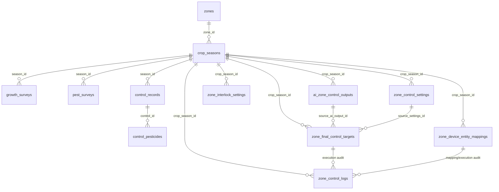

# Green Smart Project Guide

> **Audience:** Green Smart를 처음 보는 개발자, 운영자, AI coding agent
> **Repository:** `whoareyou-l/green_smart`
> **Current baseline:** `v1.9.3` / `green_smart` Home Assistant custom integration
> **Last verified locally:** 101 pytest contract tests + JS syntax check
> **Related focused design doc:** [`docs/design/zone-control-roadmap-and-data-model.md`](design/zone-control-roadmap-and-data-model.md)

---

## 1. 프로젝트 한 줄 요약

**Green Smart는 Home Assistant 안에서 온실의 작기/생육/병해충/방제/날씨/AI 제어/장치 실행을 관리하는 custom integration + sidebar panel 프로젝트다.**

제품은 Home Assistant의 `custom_components/green_smart` 통합 구성요소로 설치되며, 사용자는 Home Assistant 사이드바의 `Green Smart` 패널에서 온실 운영 데이터를 보고 제어한다.

---

## 2. 이 문서의 목적

이 문서는 프로젝트를 전혀 모르는 개발자가 다음을 이해할 수 있게 하는 **입문 + 아키텍처 + 운영 + 개발 기준 문서**다.

- Green Smart가 무엇을 하는지
- Home Assistant 안에서 어떻게 동작하는지
- repo 구조와 주요 파일 역할
- DB 스키마와 데이터 관계
- API route 전체 구조
- 프론트엔드 panel 구조
- AI 제어/장치 실행 흐름
- 테스트/배포/운영 검증 방법
- 앞으로 어디를 어떤 순서로 개발해야 하는지
- 절대 하면 안 되는 보안/운영 실수

---

## 3. 제품 범위

### 3.1 현재 Green Smart가 제공하는 영역

| 영역 | 설명 |
|---|---|
| Home Assistant 통합 | `green_smart` custom integration, config flow, HTTP API views 등록 |
| Sidebar panel | `green-smart-panel.js` 단일 Web Component 기반 UI |
| 작기 관리 | 구역별 작기 등록/수정/철거/삭제 |
| 생육조사 | 작기별 생육 데이터 기록, 작물별 dynamic metric 저장 |
| 병해충 예찰 | 작기별 병해충 발생 기록 |
| 방제 기록 | 방제 일자, 약제 목록, PLS 여부 등 기록 |
| 날씨 연동 | 기상청 단기/중기 API, 위치 검색, 7일 예보 UI |
| 농약/혼용 연동 | PSIS 농약 검색 및 혼용 조회 proxy |
| 중앙 API 활성화 | demo/local central API activation baseline, allowlisted adapter endpoints |
| 환경 제어 | 작기+구역+domain 기반 환경 제어 설정/AI output/final target/실행 |
| 관수 제어 | 관수 전략/AI 보정/final target/장치 mapping/execution 흐름 |
| 장치제어 | HA entity mapping, safe_state, 실행 로그, fail safe |
| 감사 로그 | 제어 설정 저장, AI 적용, 장치 실행, safety block 기록 |

### 3.2 현재 제품이 아직 완성하지 않은 영역

| 영역 | 상태 |
|---|---|
| Dry Run UI | 다음 Phase 14 권장 |
| Entity mapping 실시간 검증 | 다음 Phase 15 권장 |
| 실시간 센서 기반 safety rule | 다음 Phase 16 권장 |
| 운영 권한/승인 UX | Phase 17 권장 |
| 실제 AI Agent 추천 루프 | Phase 18 권장 |
| 알림/장애 통보 | Phase 19 권장 |
| 현장 리허설/시나리오 테스트 | Phase 20 권장 |
| 운영 Runbook | Phase 21 권장 |

---

## 4. Repository 성격과 배포 경계

### 4.1 이 repo의 역할

```text
/home/smartfarm/green_smart
```

이 repo는 **제품 코드 / HACS 설치용 public repository**다.

```text
GitHub: https://github.com/whoareyou-l/green_smart
HA domain: green_smart
Integration path: custom_components/green_smart
```

### 4.2 deploy repo와의 구분

운영 Docker, runtime secret, prod volume, DB/MQTT/Cloudflare 등은 제품 repo에 넣지 않는다.

```text
제품 repo:   /home/smartfarm/green_smart          public product/HACS code
배포 repo:   /home/smartfarm/green_smart-deploy   private prod/dev runtime topology
설치 repo:   /home/smartfarm/green_smart_install  private install 안내/지원용
```

### 4.3 절대 커밋하면 안 되는 것

```text
Home Assistant .storage
DB password / MQTT credential / Cloudflare token
GitHub token / SSH key
운영 .env
운영 Docker volume
고객 데이터 / 실제 센서 데이터 dump
백업 파일
```

---

## 5. 설치 모델

Green Smart는 HACS custom repository 방식으로 설치하는 것을 기본으로 한다.

1. Home Assistant에 HACS 설치
2. HACS → Integrations → Custom repositories
3. repository 추가

```text
Repository: https://github.com/whoareyou-l/green_smart
Category: Integration
```

4. `Green Smart` 설치
5. Home Assistant restart
6. Settings → Devices & services → Add integration → `Green Smart`

자세한 설치/권한/계약 해지 정책은 다음 문서를 본다.

```text
docs/install/PRIVATE_ACCESS_INSTALL.md
```

---

## 6. 기술 스택

| 계층 | 기술 |
|---|---|
| Runtime | Home Assistant custom integration |
| Backend language | Python |
| Frontend | Vanilla JavaScript Web Component, HA `panel_custom` |
| DB | MariaDB via `aiomysql` |
| External weather | KMA 단기/중기 API |
| External pesticide | PSIS API |
| Test | pytest static/contract tests, `node --check` |
| Packaging | HACS-compatible `custom_components/green_smart` |
| Release | GitHub tags/releases |

---

## 7. Top-level 구조

```text
green_smart/
├── README.md
├── custom_components/
│   └── green_smart/
│       ├── __init__.py
│       ├── manifest.json
│       ├── const.py
│       ├── config_flow.py
│       ├── db.py
│       ├── crop_views.py
│       ├── weather_api.py
│       ├── weather_views.py
│       ├── central_api.py
│       ├── central_store.py
│       ├── central_views.py
│       ├── frontend_panel.py
│       ├── zone_control_views.py
│       ├── kma_grid.py
│       ├── install.py
│       ├── api/
│       │   ├── weather.py
│       │   └── pesticide.py
│       └── panel/
│           └── green-smart-panel.js
├── docs/
│   ├── PROJECT_GUIDE.md
│   ├── design/
│   ├── decisions/
│   ├── install/
│   └── process/
└── tests/
```

---

## 8. 주요 파일 역할

### 8.1 Integration entrypoint

#### `custom_components/green_smart/__init__.py`

역할:

- Home Assistant integration setup
- DB schema bootstrap 실행
- HTTP API view 등록
- sidebar panel 등록
- virtual device mode 처리

중요 흐름:

```text
async_setup_entry
→ ensure_schema(hass)
→ register HTTP views
→ register frontend panel
```

등록되는 주요 view:

```text
Weather views
Central adapter views
Crop views
Zone control views
Domain wrapper views
```

---

### 8.2 Manifest

#### `custom_components/green_smart/manifest.json`

현재 핵심 값:

```json
{
  "domain": "green_smart",
  "name": "Green Smart",
  "config_flow": true,
  "iot_class": "local_push",
  "requirements": ["aiomysql==0.2.0"],
  "version": "1.9.3"
}
```

주의:

- panel JS 상단 `VERSION`과 manifest `version`은 일치해야 한다.
- release tag와도 맞추는 것이 운영상 좋다.

---

### 8.3 Config flow

#### `custom_components/green_smart/config_flow.py`

역할:

- Home Assistant config entry 생성
- 초기 설정 wizard input 수신
- central activation code 처리
- activation code를 config entry data에 그대로 저장하지 않도록 필터링

중요:

- panel이 HA config flow API를 호출해서 integration을 추가한다.
- activation/token 관련 값은 raw secret이 노출되지 않도록 contract test가 있다.

---

### 8.4 DB helper/schema

#### `custom_components/green_smart/db.py`

역할:

- MariaDB connection pool singleton
- query helper
- schema bootstrap

DB 환경변수:

| Env | Default |
|---|---|
| `DB_HOST` | `127.0.0.1` |
| `DB_PORT` | `3306` |
| `DB_USER` | `gs_user` |
| `DB_PASSWORD` | empty |
| `DB_NAME` | `green_smart` |

pool 설정:

```text
charset=utf8mb4
autocommit=True
minsize=2
maxsize=10
```

helper:

```python
fetchall(hass, sql, args=()) -> list[dict]
fetchone(hass, sql, args=()) -> dict | None
execute(hass, sql, args=()) -> int
ensure_schema(hass) -> None
close_pool() -> None
```

---

### 8.5 Crop API

#### `custom_components/green_smart/crop_views.py`

역할:

- 작기 등록/수정/철거/삭제
- 생육조사 CRUD
- 병해충 예찰 CRUD
- 방제 기록 CRUD

주요 route:

| Method | Route | 목적 |
|---|---|---|
| GET/POST | `/api/green_smart/crop/seasons` | 작기 목록/등록 |
| PATCH | `/api/green_smart/crop/seasons/{season_id}/demolish` | 작기 철거 처리 |
| PATCH/DELETE | `/api/green_smart/crop/seasons/{season_id}` | 작기 수정/삭제 |
| GET/POST | `/api/green_smart/crop/seasons/{season_id}/growth` | 생육조사 목록/추가 |
| DELETE | `/api/green_smart/crop/growth/{record_id}` | 생육조사 삭제 |
| GET/POST | `/api/green_smart/crop/seasons/{season_id}/pest` | 병해충 예찰 목록/추가 |
| DELETE | `/api/green_smart/crop/pest/{record_id}` | 병해충 예찰 삭제 |
| GET/POST | `/api/green_smart/crop/seasons/{season_id}/control` | 방제 기록 목록/추가 |
| DELETE | `/api/green_smart/crop/control/{record_id}` | 방제 기록 삭제 |

---

### 8.6 Weather/Pesticide API

#### `custom_components/green_smart/weather_api.py`

역할:

- KMA API client/store
- weather API key 저장/마스킹
- short/mid forecast 통합
- cache 관리

중요 상수:

```text
STORAGE_KEY = green_smart_weather
CACHE_TTL = 600 seconds
KMA_BASE = 기상청 단기 API
KMA_MID_BASE = 기상청 중기 API
```

#### `custom_components/green_smart/weather_views.py`

주요 route:

| Method | Route | 목적 |
|---|---|---|
| GET | `/api/green_smart/weather/current` | 현재 날씨 |
| GET | `/api/green_smart/weather/forecast` | 단기 예보 |
| GET | `/api/green_smart/weather/weekly` | 단기+중기 7일 예보 |
| GET/POST/DELETE | `/api/green_smart/weather/config` | 날씨 API 설정 |
| POST | `/api/green_smart/weather/validate-key` | 단기 API key 검증 |
| POST | `/api/green_smart/weather/validate-mid-key` | 중기 API key 검증 |
| POST | `/api/green_smart/weather/search-location` | KMA 격자/지역 검색 |
| GET | `/api/green_smart/pesticide/search` | PSIS 농약 검색 |
| POST | `/api/green_smart/pesticide/config` | PSIS key 저장 |
| POST | `/api/green_smart/pesticide/mix-check` | 농약 혼용 조회 |

보안 원칙:

- API key는 응답/로그에 raw 값으로 노출하지 않는다.
- URL에 key가 들어간 upstream request는 로그에 찍지 않는다.

---

### 8.7 Central API baseline

#### `custom_components/green_smart/central_api.py`
#### `custom_components/green_smart/central_store.py`
#### `custom_components/green_smart/central_views.py`

역할:

- Greenity central API demo/local activation baseline
- access/refresh token store
- allowlisted adapter endpoint만 제공

중요 원칙:

```text
generic /vendor/proxy는 Home Assistant client에 노출하지 않는다.
allowlisted endpoint만 사용한다.
activation code는 저장하지 않는다.
raw token/secret은 응답/로그에 노출하지 않는다.
```

주요 route:

| Method | Route | 목적 |
|---|---|---|
| POST | `/api/green_smart/central/weather/current` | central weather current adapter |
| POST | `/api/green_smart/central/weather/forecast` | central short forecast adapter |
| POST | `/api/green_smart/central/weather/mid` | central mid forecast adapter |
| POST | `/api/green_smart/central/pesticide/search` | central pesticide search adapter |

---

### 8.8 Zone control API

#### `custom_components/green_smart/zone_control_views.py`

이 파일은 Green Smart 제어 시스템의 핵심 backend다.

관리하는 영역:

```text
zone-scoped settings
copy settings
AI outputs
final targets
HA entity mappings
final target execution
interlock/fail safe
execution logs
```

자세한 DB/flow는 다음 문서가 authoritative하다.

```text
docs/design/zone-control-roadmap-and-data-model.md
```

공통 zones route:

| Method | Route | 목적 |
|---|---|---|
| GET/POST | `/api/green_smart/zones/control-settings` | scoped 설정 조회/저장 |
| GET/POST | `/api/green_smart/zones/interlock-settings` | scoped 인터록/안전 기준 설정 조회/저장 |
| GET/POST | `/api/green_smart/zones/control-mode` | manual/auto/assist/disabled 및 override 상태 조회/저장 |
| GET | `/api/green_smart/zones/entity-state-summary` | Entity Mapping 기준 HA 현재 상태 요약 조회 |
| POST | `/api/green_smart/zones/copy-control-settings` | zone 설정 복사 |
| GET/POST | `/api/green_smart/zones/final-targets` | 최종 적용값 조회/저장 |
| GET/POST | `/api/green_smart/zones/ai-control-outputs` | AI output 조회/저장 |
| POST | `/api/green_smart/zones/ai-control-outputs/{output_id}/apply` | AI output을 final target으로 적용 |
| GET/POST/DELETE | `/api/green_smart/zones/device-entity-mappings` | HA entity mapping 관리 |
| POST | `/api/green_smart/zones/execute-final-targets` | final target 실행 |
| GET | `/api/green_smart/zones/control-logs` | 감사/실행 로그 조회 |

Domain wrapper route:

```text
/api/green_smart/environment/...
/api/green_smart/irrigation/...
/api/green_smart/devices/...
```

---

### 8.9 Frontend panel

#### `custom_components/green_smart/panel/green-smart-panel.js`

역할:

- Home Assistant sidebar panel UI 전체
- 단일 custom element `green-smart-panel`
- setup wizard
- dashboard
- crop management
- weather/pesticide UI
- environment/irrigation/device control UI
- zone-scoped storage fallback
- API 호출 및 cache 관리

현재 구조는 React/Vue가 아니라 **vanilla Web Component**다. React/TypeScript 요청이 있어도 live product UI는 이 파일에서 구현한다.

중요 global constants:

```js
const DOMAIN = "green_smart";
const VERSION = "1.9.3"
```

중요 UI 페이지:

| Page | 설명 |
|---|---|
| Dashboard | 온실 상태, 그래프, 장비 상태 |
| 초기 설정 wizard | Home Assistant config flow 연동 |
| 작기 관리 | 작기/생육/병해충/방제 |
| 날씨/농약 | KMA/PSIS API 연동 UI |
| 환경 제어 | environment domain control |
| 관수 제어 | irrigation domain control |
| 장치제어 | device domain control |

---

### 8.10 Frontend panel registration

#### `custom_components/green_smart/frontend_panel.py`

역할:

- `panel_custom` 등록
- `/local/green-smart-panel.js` 또는 custom component static resource를 sidebar에 연결
- panel registration idempotency 보장

운영 검증 시 로그에서 아래 marker를 확인한다.

```text
green_smart panel registered successfully at url_path=green_smart
```

---

## 9. DB schema 전체

Green Smart DB는 크게 3개 그룹으로 나뉜다.

```text
1. 작기/생육/병해충/방제 기록
2. 날씨/외부 API token store는 HA Store 기반
3. zone-scoped AI/control/execution tables
```

---

## 10. Crop management DB

### 10.1 `zones`

온실 구역 master table.

```text
id
name
created_at
updated_at
```

`_ensure_zone()`이 필요한 zone을 자동 생성한다.

---

### 10.2 `crop_seasons`

작기/재배 기간 master table.

주요 컬럼:

```text
id
greenhouse_id
zone_id
crop_type
variety
method
plant_date
demolish_date
row_spacing
plant_spacing
total_plants
plant_density
notes
deleted_at
created_at
updated_at
```

---

### 10.3 `growth_surveys`

생육조사 기록.

주요 컬럼:

```text
season_id
survey_date
plant_height
leaf_count
stem_diameter
truss_count
node_count
crop_type
metrics_json
notes
deleted_at
```

`metrics_json`은 작물별 dynamic metric 확장용이다.

---

### 10.4 `pest_surveys`

병해충 예찰 기록.

```text
season_id
survey_date
pest_type
location
severity
notes
deleted_at
```

---

### 10.5 `control_records` / `control_pesticides`

방제 기록 header/detail 구조.

```text
control_records
├─ id
├─ season_id
├─ control_date
├─ zone_description
└─ notes

control_pesticides
├─ control_id
├─ sort_order
├─ pesticide_name
├─ reg_no
├─ mode_of_action
├─ dilution_ratio
├─ usage_amount
└─ pls_compliant
```

---

## 11. Zone control DB

제어 시스템의 공통 scope key:

```text
farm_id + crop_season_id + zone_id + domain
```

### 11.1 `zone_control_settings`

운영자가 UI에서 저장한 domain별 설정.

```text
settings_json
version
created_by
updated_by
```

Unique:

```text
farm_id, crop_season_id, zone_id, domain
```

---

### 11.2 `zone_interlock_settings`

Phase 1A에서 추가된 Zone/domain별 인터록 설정 저장소.

```text
settings_json
enabled
created_by
updated_by
created_at
updated_at
```

Unique:

```text
farm_id, crop_season_id, zone_id, domain
```

초기에는 JSON 설정으로 저장하고, Phase 2 SafetyGuard에서 필요한 항목만 migration task로 정규화한다.

---

### 11.3 `zone_control_modes`

Phase 1D에서 추가된 Zone/domain별 manual/auto/assist/disabled 및 override 기본 상태.

```text
mode
allow_auto_execution
override_reason
override_expires_at
created_by
updated_by
created_at
updated_at
```

Unique:

```text
farm_id, crop_season_id, zone_id, domain
```

실행 정책:

```text
manual   → 실제 실행 차단, dry-run 허용
auto     → allow_auto_execution=true일 때 실행 허용
assist   → allow_auto_execution=true일 때 실행 허용
disabled → 실제 실행 차단
```

`execute-final-targets`는 HA service call 전에 이 mode를 조회하고, 차단 시 `blocked_by_control_mode` 로그를 남긴다.

---

### 11.4 `ai_zone_control_outputs`

AI Agent 또는 시스템이 생성한 제어 전략 후보.

```text
model_name
strategy_json
explanation
safety_status
applied
```

AI output은 “후보”다. 실행 대상이 아니다.

---

### 11.4 `zone_final_control_targets`

실제 실행 대상으로 확정된 최종 target.

```text
targets_json
source_ai_output_id
source_settings_id
calculated_by
created_at
```

append-only 성격이다. 최신 target은 `created_at DESC, id DESC`로 조회한다.

---

### 11.5 `zone_device_entity_mappings`

final target의 논리값을 Home Assistant entity로 연결.

```text
device_type
entity_id
control_role
safe_state
enabled
note
```

target lookup 순서:

```text
1. control_role
2. device_type
3. exact entity_id
4. entity_id에서 .을 _로 바꾼 key
```

---

### 11.6 `zone_control_logs`

모든 제어 변경/실행/차단/검증의 감사 로그.

```text
action
before_json
after_json
result
message
created_at
```

주요 action:

```text
control_settings_saved
control_settings_copied
ai_output_saved
final_targets_saved
ai_output_applied_to_final_targets
device_entity_mapping_saved
device_entity_mapping_deleted
final_targets_executed
final_target_execution_failed
state_verification_passed
state_verification_failed
interlock_blocked
failsafe_applied
execution_safety_blocked
fail_safe_service_call_failed
```

---

### 11.6 `zone_control_copy_jobs`

zone 설정 복사 작업 이력.

```text
from_zone_id
to_zone_ids
copied_settings_json
actor
result
```

---

## 12. 주요 데이터 관계



현재 DB에는 명시적 foreign key를 거의 두지 않는다. 관계는 app-level convention으로 유지한다.

---

## 13. AI/Control execution flow

### 13.1 제어 설정 저장

```text
운영자 UI
→ _setScopedControlState(domain)
→ localStorage fallback
→ POST /zones/control-settings
→ zone_control_settings
→ zone_control_logs(control_settings_saved)
```

### 13.2 AI output 저장/적용

```text
AI Agent or system
→ POST /zones/ai-control-outputs
→ ai_zone_control_outputs
→ 운영자 UI 검토
→ POST /zones/ai-control-outputs/{id}/apply
→ zone_final_control_targets
→ ai_zone_control_outputs.applied = 1
→ zone_control_logs(ai_output_applied_to_final_targets)
```

### 13.3 final target 실행

```text
POST /zones/execute-final-targets
→ latest zone_final_control_targets
→ enabled zone_device_entity_mappings
→ target value resolve
→ service call build
→ preState snapshot
→ interlock/fail safe decision
→ HA services.async_call
→ homeassistant.update_entity
→ postState snapshot
→ state verification
→ zone_control_logs
→ UI execution/safety log card
```

### 13.4 Safety/fail safe policy

`targets_json` 안에 `_safety` 또는 `safety` key를 넣는다.

```json
{
  "_safety": {
    "emergency_stop": false,
    "block_on_unavailable": true,
    "apply_safe_state_on_block": true,
    "rules": [
      {
        "control_role": "ventilation",
        "block": true,
        "reason": "strong_wind"
      }
    ]
  }
}
```

현재 지원:

| 조건 | 결과 |
|---|---|
| `emergency_stop` | 해당 call 차단 |
| unavailable entity | 기본 차단 |
| matching rule | 차단 |
| safe_state 존재 | safe_state service call 대체 |
| safe_state 없음 | execution_safety_blocked |

---

## 14. Frontend page structure

### 14.1 공통 shell

Panel은 하나의 Web Component에서 sidebar, dashboard, subpage를 모두 render한다.

```text
custom element: green-smart-panel
file: custom_components/green_smart/panel/green-smart-panel.js
```

### 14.2 제어 페이지 공통 구조

환경/관수/장치제어는 현재 공통 구조를 따른다.

```text
Sub hero
Control Scope Bar
AI 전략 출력 / 최종 적용값 카드
실행/안전 로그 카드
장치/센서 Entity 매핑 카드
각 domain별 설정 탭
```

### 14.3 localStorage fallback

제어 설정은 DB/API를 우선하지만, UI 반응성과 rollback을 위해 localStorage fallback을 유지한다.

주요 key:

```text
green_smart_zone_control_settings
green_smart_zone_control_migrated_v1
```

### 14.3 Panel element refresh contract

Phase 1C부터 제어 페이지의 인터록 설정, Entity 상태 요약, 실행/안전 로그 카드는 `PANEL_ELEMENT_REFRESH_MS = 5000` 기준으로 요소별 갱신한다.

```text
_startZoneElementRefresh()
_refreshZoneControlElements({ patchOnly: true })
_patchZoneControlElementCards(domain)
_replaceZoneControlCard(selector, html)
```

주기 refresh는 전체 `_update()`를 호출하지 않는다. 사용자가 textarea/input/select 또는 zone-control editor 카드에서 입력 중이면 `_hasDirtyZoneControlEditor()`가 tick을 건너뛰어 dirty state를 보존한다.

---

## 15. 테스트 구조

테스트는 대부분 Home Assistant를 직접 띄우지 않는 static/contract test다. 목적은 **기능 계약이 깨졌는지 빠르게 감지**하는 것이다.

### 15.1 테스트 파일

| File | 범위 |
|---|---|
| `test_manifest_contract.py` | manifest domain/version/requirements |
| `test_panel_contract.py` | panel registration, version, secret/prod URL scan |
| `test_frontend_panel_contract.py` | dashboard, crop UI, control UI contract |
| `test_db_contract.py` | DB env/pool/schema/crop DB contract |
| `test_zone_control_api_contract.py` | zone control DB/API/UI contract |
| `test_weather_api_contract.py` | KMA store/cache/key masking |
| `test_weather_views_contract.py` | weather/pesticide auth/key safety |
| `test_kma_grid.py` | KMA grid/regId search |
| `test_config_flow_contract.py` | config flow/wizard contract |
| `test_central_*` | central activation/store/API/UX contract |
| `test_external_api_contract.py` | weather/pesticide client interfaces |

### 15.2 기본 검증 명령

```bash
cd /home/smartfarm/green_smart
pytest -q
node --check custom_components/green_smart/panel/green-smart-panel.js
python3 -m py_compile \
  custom_components/green_smart/db.py \
  custom_components/green_smart/zone_control_views.py \
  custom_components/green_smart/__init__.py
```

현재 기대값:

```text
101 passed
node --check: no output / exit 0
py_compile: no output / exit 0
```

---

## 16. 운영 배포/검증 흐름

운영 Home Assistant 컨테이너 이름은 현재 다음으로 사용 중이다.

```text
greenity-prod-homeassistant
```

운영 반영 시 일반 흐름:

```text
1. product repo에서 테스트 통과
2. custom_components/green_smart를 HA /config/custom_components에 반영
3. panel JS를 /config/www/green-smart-panel.js에 반영
4. container 내부 py_compile
5. HA check_config
6. HA restart
7. /local/green-smart-panel.js?v=<version> HTTP 200 확인
8. panel marker 확인
9. green_smart panel registered successfully 로그 확인
```

예시 검증 marker:

```text
STATIC_PANEL_HTTP=200
SERVED_PANEL_MARKERS=True,...
green_smart panel registered successfully at url_path=green_smart
```

운영 재시작 중 `aiomysql` deallocator의 `Event loop is closed` traceback이 보일 수 있다. 현재까지는 HA 종료 시점 경고로 취급했다. 단, 아래가 모두 정상이어야 한다.

```text
HA HTTP 200
panel registered log
static panel served
config check success
```

---

## 17. Release/version policy

현재 관례:

```text
manifest.json version
panel VERSION constant
Git tag vX.Y.Z
GitHub release vX.Y.Z
```

모두 일치시키는 것을 원칙으로 한다.

최근 기준:

```text
v1.9.3
```

---

## 18. 보안 원칙

### 18.1 secret handling

- API key는 raw로 응답하지 않는다.
- token/activation code는 log/error에 넣지 않는다.
- GitHub token은 `.env`에서 로드하되 출력하지 않는다.
- 제품 repo에 runtime secret을 넣지 않는다.

### 18.2 external API

- Central API는 allowlisted endpoint만 사용한다.
- generic vendor proxy는 HA client에 노출하지 않는다.
- KMA/PSIS request URL에 key가 포함될 수 있으므로 URL logging을 피한다.

### 18.3 device execution safety

- unavailable entity는 기본 차단한다.
- safe_state가 없으면 위험 장비로 본다.
- execution log 없이 실제 장비를 움직이는 경로를 만들지 않는다.
- AI output은 바로 실행하지 않고 final target으로 승격된 후 실행한다.

---

## 19. 개발 원칙

앞으로 기능을 추가할 때는 다음 순서를 지킨다.

```text
1. 기존 문서/데이터 모델 확인
2. 계약 테스트 RED 작성
3. 최소 구현
4. targeted test GREEN
5. full pytest
6. node --check
7. py_compile
8. 운영 반영 필요 시 check_config/restart/smoke
9. 문서 업데이트
10. commit/tag/release
```

### 19.1 중요한 문서

| 문서 | 역할 |
|---|---|
| `docs/PROJECT_GUIDE.md` | 프로젝트 전체 핸드북 |
| `docs/PROJECT_MASTER_PLAN.md` | 새 마스터 플랜과 기존 문서/코드를 정렬한 현재 개발 기준 |
| `.omc/plans/green-smart-master-plan.md` | 사용자가 제공한 새 마스터 플랜 원문 repo 사본 |
| `docs/design/system-architecture.md` | HA custom integration, edge appliance, SaaS/deploy 경계 |
| `docs/design/data-model.md` | 현재/확장 DB와 저장 정책 기준 |
| `docs/design/control-engine-contracts.md` | CORP/TEMHUM/IRR/VENT/SCRN/SafetyGuard 계약 |
| `docs/design/api-spec.md` | 기존/향후 API 경로와 호환성 기준 |
| `docs/design/home-assistant-integration-contract.md` | HA integration, panel, entity/service call, persistent notification 계약 |
| `docs/design/zone-control-roadmap-and-data-model.md` | 제어/DB/AI execution 세부 기준 |
| `docs/design/zone-scoped-control-settings.md` | zone-scoped control 초기 설계 |
| `docs/design/irrigation-control-page.md` | 관수 제어 페이지 설계 |
| `docs/design/device-control-page.md` | 장치제어 페이지 설계 |
| `docs/process/TESTING.md` | 테스트 실행 기준 |
| `docs/process/SECURITY_GATES.md` | 보안 gate |
| `docs/process/DEFINITION_OF_DONE.md` | 완료 기준 |
| `docs/process/IMPLEMENTATION_AND_VERIFICATION_PROCESS.md` | 구현/검증 절차 |
| `docs/decisions/ADR-0001-repository-split-and-paperclip-deprecation.md` | repo split/Paperclip 비활성 결정 |

### 19.2 Agent/tooling 주의

README에는 과거 workflow 흔적이 남아 있을 수 있다. 현재 운영 메모 기준으로는 **Antigravity CLI는 사용하지 않는다.** 표준 Hermes tools, terminal/file/git, 필요 시 Codex/Claude 계열 agent workflow만 사용한다.

---

## 20. 현재 상태와 앞으로의 개발 로드맵

### 20.1 현재 상태

현재 Green Smart는 다음 구조까지 구현되어 있다.

```text
작기/구역/domain scope
→ 설정 저장
→ AI output 저장
→ final target 적용
→ HA entity mapping
→ service call 실행
→ interlock/fail safe
→ pre/post state verification
→ execution/safety UI log
```

### 20.2 최소 실사용까지 필요한 단계

| Phase | 내용 | 이유 |
|---:|---|---|
| 14 | Dry Run UI | 실제 장비 실행 전 call/safety/failsafe를 미리 봐야 함 |
| 15 | Entity Mapping 검증 | entity_id 오입력, service 호환성, safe_state 검증 필요 |
| 16 | 실시간 Sensor Safety Rule | 풍속/강우/탱크수위/펌프 fault 기반 차단 필요 |

### 20.3 운영 완성까지 필요한 단계

| Phase | 내용 |
|---:|---|
| 17 | 운영 모드/권한/확인 UX |
| 18 | 실제 AI Agent 추천 루프 |

### 20.4 상용/고객 배포까지 필요한 단계

| Phase | 내용 |
|---:|---|
| 19 | 알림/장애 통보 |
| 20 | 현장 리허설/시나리오 테스트 |
| 21 | 운영 Runbook |

---

## 21. 신규 개발자가 가장 먼저 읽을 순서

1. `README.md`
2. `docs/PROJECT_GUIDE.md` ← 이 문서
3. `docs/design/zone-control-roadmap-and-data-model.md`
4. `custom_components/green_smart/manifest.json`
5. `custom_components/green_smart/__init__.py`
6. `custom_components/green_smart/db.py`
7. `custom_components/green_smart/zone_control_views.py`
8. `custom_components/green_smart/panel/green-smart-panel.js`
9. `tests/test_zone_control_api_contract.py`
10. `tests/test_frontend_panel_contract.py`

---

## 22. 빠른 로컬 체크리스트

```bash
cd /home/smartfarm/green_smart

git status --short
pytest -q
node --check custom_components/green_smart/panel/green-smart-panel.js
python3 -m py_compile custom_components/green_smart/db.py custom_components/green_smart/zone_control_views.py custom_components/green_smart/__init__.py
```

기대:

```text
git status clean 또는 의도한 변경만 표시
101 passed
node --check exit 0
py_compile exit 0
```

---

## 23. Glossary

| 용어 | 의미 |
|---|---|
| 작기 / crop season | 특정 구역에서 특정 작물을 재배하는 기간 |
| zone | 온실 내 구역 |
| domain | `environment`, `irrigation`, `device` 제어 영역 |
| AI output | AI가 만든 제어 전략 후보 |
| final target | 운영자가 적용했거나 시스템이 확정한 실행 대상 제어값 |
| entity mapping | final target을 HA entity/service call로 연결하는 설정 |
| safe_state | 차단 시 장비가 가야 할 안전 상태 |
| interlock | 위험 조건에서 실행을 차단하는 안전 장치 |
| fail safe | 차단 시 안전 상태로 대체 실행하는 동작 |
| preState/postState | 실행 전/후 Home Assistant entity 상태 snapshot |
| control log | 설정/실행/차단/검증 감사 로그 |

---

## 24. 이 문서 유지 규칙

이 문서는 다음 경우 반드시 갱신한다.

```text
새 API route 추가
DB 테이블/컬럼 변경
frontend page 구조 변경
실행/safety flow 변경
설치/배포 방식 변경
테스트 기준 변경
Phase 완료 또는 로드맵 변경
```

작업자가 이 문서를 갱신하지 않고 큰 기능을 추가하면, 다음 개발자가 전체 구조를 잃어버리게 된다. 기능 구현과 문서 갱신은 같은 작업의 일부로 취급한다.
