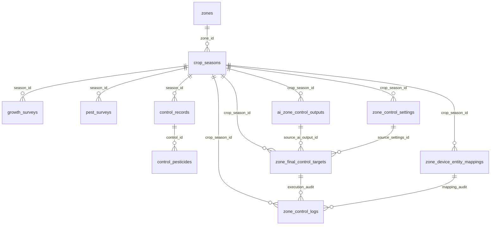

# Green Smart Data Model

> Status: historical/adapter reference
> Do not use as product direction.
> Current source of truth: `docs/master/03-database-schema.md`, `docs/rebuild/legacy-direction-inventory.md`

> Phase 0 data model baseline.  
> Parent: `docs/PROJECT_MASTER_PLAN.md`

## 1. Scope model

Current implemented scope key:

```text
farm_id + crop_season_id + zone_id + domain
```

Master-plan semantic scope:

```text
customer/site/edge/farm/greenhouse/zone/crop season/domain
```

Do not immediately rewrite existing tables. Keep current scope and design future migrations so `customer_id`, `site_id`, `edge_id`, and `greenhouse_id` can be added without breaking API contracts.

## 2. Existing core tables

### Crop/operation tables

```text
zones
crop_seasons
growth_surveys
pest_surveys
control_records
control_pesticides
```

### Zone control tables

```text
zone_control_settings
zone_interlock_settings
ai_zone_control_outputs
zone_final_control_targets
zone_device_entity_mappings
zone_control_logs
zone_control_copy_jobs
```

### `zone_interlock_settings`

Purpose: Phase 1A implemented table for zone/domain-scoped operator interlock configuration.

Current columns:

```text
id
farm_id
crop_season_id
zone_id
domain
settings_json
enabled
created_by
updated_by
created_at
updated_at
```

The table stores JSON settings first to avoid premature schema churn. Phase 2 SafetyGuard may normalize parts into explicit columns only through a migration task.

## 3. Existing control relationships



## 4. Adopted storage policy

| Data | Storage |
|---|---|
| Current HA entity state | Home Assistant state machine |
| High-frequency raw sensor history | HA recorder / InfluxDB |
| Strategy decision snapshot | MariaDB, 5-minute cadence + immediate on target change |
| final target | MariaDB `zone_final_control_targets` |
| execution/audit/control log | MariaDB `zone_control_logs` |
| AI candidate output | MariaDB `ai_zone_control_outputs` |
| crop/growth/pest/control records | MariaDB permanent records |

## 5. Candidate future tables

These are not implemented yet. Add only through explicit migration tasks and contract tests.

### `zone_strategy_snapshots`

Purpose: store reproducible strategy input/output every 5 minutes and immediately when normalized target changes.

Suggested columns:

```text
id
farm_id
crop_season_id
zone_id
domain
engine_source          -- CORP/TEMHUM/IRR/VENT/SCRN/SafetyGuard
snapshot_json          -- normalized inputs/derived values
targets_json           -- candidate/final target at snapshot time
reason
target_hash
created_at
```

### `zone_control_safety_events`

Purpose: event-level safety/interlock history and notification lifecycle.

Suggested columns:

```text
id
farm_id
crop_season_id
zone_id
domain
severity              -- critical/warning/info
event_type            -- strong_wind/sensor_unavailable/vwc_low/ec_high/etc.
entity_id
reason
before_json
after_json
notification_id
acknowledged_at
resolved_at
created_at
```

### `crop_growth_scores`

Purpose: persist B-Score/V-Score/G-Index and related crop strategy scores.

Suggested columns:

```text
id
farm_id
crop_season_id
zone_id
crop_type
growth_phase
b_score
v_score
g_index
inputs_json
reason
created_at
```

## 6. Migration principles

1. Do not drop existing columns/tables without explicit user approval.
2. Do not change existing API response shape unless migration compatibility is documented.
3. New tables must have contract tests in `tests/test_db_contract.py` or domain-specific tests.
4. Keep `zone_control_logs` as the mandatory audit trail even if safety event tables are added.
5. Raw sensor time-series must not be duplicated into MariaDB except strategy snapshots.
