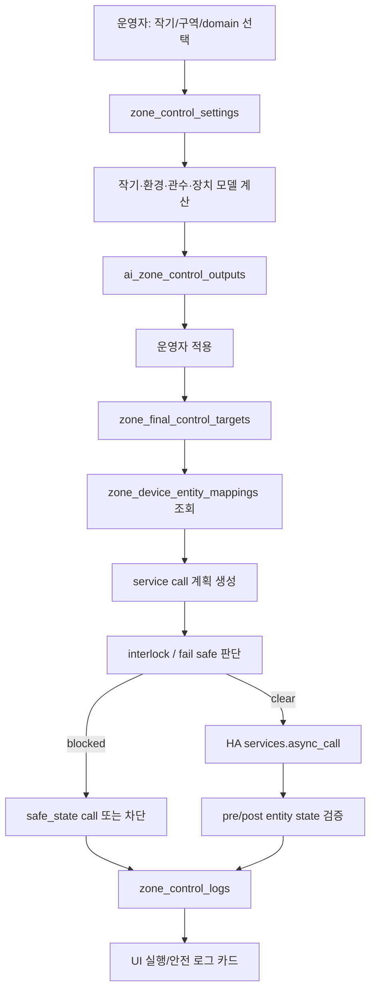
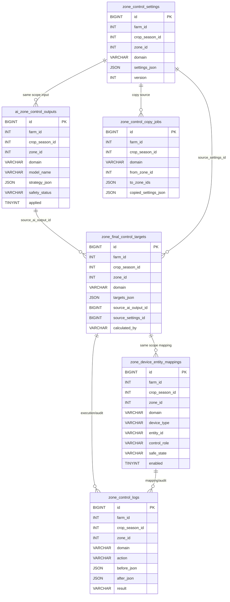

# Green Smart Zone Control Roadmap and Data Model

> 작성일: 2026-06-20
> 기준 버전: `v1.9.42` / Product Phase 6 baseline 완료, Crop Safety Rules C-S1B baseline 완료, Crop Interlock C-S2 baseline 완료, Model Phase M1 작기 모델 snapshot baseline 완료, UI Polish Phase P4 완료, Control Phase C19D 완료
> 대상 파일: `custom_components/green_smart/db.py`, `custom_components/green_smart/zone_control_views.py`, `custom_components/green_smart/panel/green-smart-panel.js`

## 1. 이 문서의 목적

최근 제어 기능이 빠르게 확장되면서 단계별 구현은 진행됐지만, 전체 방향성과 DB 관계가 한눈에 보이는 기준 문서가 부족했다. 이 문서는 앞으로의 작업이 가이드라인 없이 누적되지 않도록 다음을 고정한다.

1. 현재까지 구현된 제어 아키텍처의 목적과 범위
2. DB 테이블 구성과 관계성
3. API/UI/실행 흐름
4. 완료된 Control Phase와 남은 Control Phase의 기준
5. 실사용 가능 기준과 상용 배포 기준
6. 앞으로 작업 시 지켜야 할 원칙과 중단 조건

---

## 2. 현재 진행 방향 요약

Green Smart 제어 기능의 방향은 단순 설정 저장이 아니라 아래 운영 루프를 완성하는 것이다.

```text
작기/구역 선택
→ domain별 안전 룰 평가
→ domain별 인터록/fallback 결정
→ 안전/인터록을 통과한 경우에만 모델(AI)이 전략/운영 candidate target 생성
→ AI output 저장
→ 운영자가 검토 후 final target으로 적용
→ HA entity mapping 기준으로 service call 변환
→ dry run / safety check / fail safe 확인
→ 실제 실행
→ 실행 전후 entity state 검증
→ 감사 로그와 운영자 UI 확인
```

여기서 domain은 다음 3개로 고정한다.

| Domain | UI 페이지 | 주 대상 |
|---|---|---|
| `environment` | 환경 제어 | 온도, 습도, VPD, CO₂, 환기/난방 환경 제어 |
| `irrigation` | 관수 제어 | 관수량, EC, pH, 드라이백, 양액/배액 제어 |
| `device` | 장치제어 | 환기창, 스크린, 팬, 펌프 등 일반 설비 제어 |

핵심 scope key는 모든 제어 테이블에서 동일하게 유지한다.

```text
farm_id + crop_season_id + zone_id + domain
```

이 scope가 Green Smart 제어 데이터의 실질적 “파티션 키”다.

---

## 2.1 작기·환경·관수·장치 모델 관계 기준

v1.9.42 이후 제어 기능은 단순히 domain별 설정을 저장하는 구조가 아니라, **각 domain 내부는 Safety → Interlock → Model(AI)** 순서로 해석한다. domain 간 참조 순서는 `Crop → Environment → Irrigation → Device`다.

```text
작물 안전 룰(Crop Safety Rules)
  - 활성 작기 존재, 작물 종류 신뢰도, 생육조사 freshness, 병해 위험, 생육 이상치
  - block/fallback reasonCode를 deterministic하게 산출

작물 인터록(Crop Interlock/Fallback Rules)
  - crop safety 결과에 따라 model target promotion 차단, operator confirmation, conservative baseline fallback 결정

작기 모델(Crop Season Model)
  - crop_season_id + zone_id 기준
  - 작물 종류/품종/정식일/재식밀도/생육조사/병해충/방제 기록
  - 생육단계, G-Index, 수확량 예측, 병해 위험도 산출

환경 안전 룰 → 환경 인터록 → 환경 전략 모델(Environment Strategy Model)
  - crop_season_id + zone_id + domain=environment 기준
  - 작기 safety/interlock/model + 날씨 + HA sensor + 운영자 보정을 입력으로 사용
  - ADT/DIF/VPD/CO₂/환기/스크린/난방 target 산출

관수 안전 룰 → 관수 인터록 → 관수 전략 모델(Irrigation Strategy Model)
  - crop_season_id + zone_id + domain=irrigation 기준
  - 작기 + 환경 결과 + 일사/VWC/EC/pH/배액 feedback을 입력으로 사용
  - 급액량/간격/EC/pH/드라이백/배액률 target 산출

장치 안전 룰/Fail Safe → 장치 인터록 → 장치 운영 모델(Device Operation Model)
  - crop_season_id + zone_id + domain=device 또는 실행 대상 domain 기준
  - 환경/관수 final target + entity mapping + 장치 capability + HA state를 입력으로 사용
  - dry-run/service call plan/safe_state/post-state verification/장치 이상 판단 산출
```

관계 원칙:

1. 각 domain은 반드시 Safety → Interlock → Model(AI) 순서로 구현한다.
2. 작물 안전 룰과 작물 인터록은 모든 전략 모델의 선행 조건이다.
3. 작기 모델은 안전/인터록을 통과한 뒤 환경·관수·장치 판단의 공통 기준 입력이 된다.
4. 환경 전략 모델의 VPD/온도/습도/일사 판단은 관수 전략 모델의 급액량·간격·드라이백 판단에 들어간다.
5. 관수 실행/배액 feedback은 작기 모델의 생육 리포트·병해 위험·수확량 confidence 보정 근거가 된다.
6. 장치 운영 모델은 final target을 실제 HA service call plan으로 변환하는 실행 계층이다.
7. 모든 모델 출력은 Control Mode / Limited Auto / Operator Confirmation / SafetyGuard / Interlock보다 우선할 수 없다.
8. 사용자-facing UI에서는 `MVP`가 아니라 `환경 전략 모델`, `관수 전략 모델`, `장치 운영 모델`로 표시한다. 내부 `calculated_by` legacy 값은 호환을 위해 유지할 수 있다.

---

## 3. 현재 완료된 Control Phase

| Control Phase | 상태 | 요약 |
|---:|---|---|
| C1 | 완료 | 공통 작기/구역 Scope Bar |
| C2 | 완료 | 작기+구역별 localStorage 분리 저장 |
| C3 | 완료 | 저장 대상/마지막 저장 UX |
| C4 | 완료 | 구역별 설정 복사 |
| C5 | 완료 | DB/API 설계 문서 및 방향 수립 |
| C6 | 완료 | backend/API 저장 구조 구현 |
| C7 | 완료 | AI output/final target 저장 API |
| C8 | 완료 | UI에서 AI output/final target 조회/적용 |
| C9 | 완료 | HA Entity 매핑 DB/API/UI |
| C10 | 완료 | final targets → HA service call 실행 |
| C11 | 완료 | 실행 전/후 entity state 수집 및 검증 |
| C12 | 완료 | 인터록 / Fail Safe 실행 차단 엔진 |
| C13 | 완료 | 운영 UI에서 실행/안전 로그 카드 표시 |
| C14 | 완료 | Dry Run UI |
| C15 | 완료 | Entity Mapping 실시간 검증 |
| C16 | 완료 | 실시간 센서 기반 Safety Rule |
| C17 | 완료 | 운영자 실행 확인 UX |
| C18 | 완료 | 현장 리허설 readiness |
| C19 | 완료 | 가상 장치 기반 리허설 테스트 하네스 |
| C19B | 완료 | 가상 HA 엔티티 생성 |
| C19C | 완료 | 관수설정 초기 진입 no-flicker hydration |
| C19D | 완료 | 가상 리허설 시나리오 증거 리포트 |

현재 상태는 **제어 데이터 저장 → final target 실행 → 안전 차단 → 로그 확인 → Dry Run → 가상 HA 엔티티 기반 리허설 → 관수설정 no-flicker hydration → C20 gate 전 가상 시나리오 증거 리포트**까지 구조적으로 연결된 상태다. 실제 장비 연결은 아직 금지이며, 제한적 실제 현장 리허설과 운영 Runbook이 다음 안정화 단계다.

---

## 4. 전체 데이터 흐름



---

## 5. DB 테이블 구성

### 5.1 공통 scope

아래 6개 제어 핵심 테이블은 모두 다음 scope를 공유한다.

```text
farm_id
crop_season_id
zone_id
domain
```

단, `zone_control_copy_jobs`는 복사 작업 특성상 `zone_id` 대신 `from_zone_id`, `to_zone_ids`를 가진다.

---

### 5.2 `zone_control_settings`

**목적:** 운영자가 UI에서 저장한 domain별 제어 설정의 최신 상태 저장.

```sql
CREATE TABLE zone_control_settings (
  id BIGINT AUTO_INCREMENT PRIMARY KEY,
  farm_id INT NOT NULL DEFAULT 1,
  crop_season_id INT NOT NULL,
  zone_id INT NOT NULL,
  domain VARCHAR(32) NOT NULL,
  settings_json JSON NOT NULL,
  version INT NOT NULL DEFAULT 1,
  created_by VARCHAR(128) NULL,
  updated_by VARCHAR(128) NULL,
  created_at TIMESTAMP NOT NULL DEFAULT CURRENT_TIMESTAMP,
  updated_at TIMESTAMP NOT NULL DEFAULT CURRENT_TIMESTAMP ON UPDATE CURRENT_TIMESTAMP,
  UNIQUE KEY uniq_zone_control_settings (farm_id, crop_season_id, zone_id, domain),
  KEY idx_zone_control_settings_lookup (farm_id, crop_season_id, domain)
)
```

**관계:**

```text
zone_control_settings 1개
→ 같은 scope의 AI output 또는 final target 계산 근거가 될 수 있음
```

**주의:** 현재 FK는 명시되어 있지 않다. Home Assistant custom component의 점진적 스키마 특성상 app-level 참조로 관리한다.

---

### 5.3 `zone_interlock_settings`

**목적:** Phase 1A에서 추가된 Zone/domain별 인터록/안전 기준 설정 저장.

```sql
CREATE TABLE zone_interlock_settings (
  id BIGINT AUTO_INCREMENT PRIMARY KEY,
  farm_id INT NOT NULL DEFAULT 1,
  crop_season_id INT NOT NULL,
  zone_id INT NOT NULL,
  domain VARCHAR(32) NOT NULL,
  settings_json JSON NOT NULL,
  enabled TINYINT(1) NOT NULL DEFAULT 1,
  created_by VARCHAR(128) NULL,
  updated_by VARCHAR(128) NULL,
  created_at TIMESTAMP NOT NULL DEFAULT CURRENT_TIMESTAMP,
  updated_at TIMESTAMP NOT NULL DEFAULT CURRENT_TIMESTAMP ON UPDATE CURRENT_TIMESTAMP,
  UNIQUE KEY uniq_zone_interlock_settings (farm_id, crop_season_id, zone_id, domain),
  KEY idx_zone_interlock_settings_lookup (farm_id, crop_season_id, domain, enabled)
)
```

**주의:** 현재는 JSON 설정 저장소다. Phase 2A부터 panel의 `settings_json.rules[]`는 SafetyGuard decision layer에서 실행 전 판단에 반영된다. Phase 2B부터 강풍/저온/고온/VWC/EC/센서 무결성 semantic preset baseline은 `condition + threshold + reasonCode`로 표현한다. Phase 2C부터 watchdog API가 1분 fallback 검사 marker와 critical event notification hook을 제공한다. Phase 2D부터 watchdog은 `async_track_time_interval` scheduler와 stale timestamp age policy를 가진다. Phase 2E부터 SafetyGuard event lifecycle은 우선 `zone_control_logs`의 ack/clear action 조합으로 표현한다. Phase 2F부터 clear lifecycle은 `persistent_notification.dismiss`, dedupe reset, `operatorNote`를 함께 처리한다. 추후 운영 규칙이 정교해지면 migration task로 필요한 컬럼/이벤트 테이블을 분리한다. Phase 1E부터 panel은 `settings_json.rules[]`를 구조화 rule builder UI로 편집하지만 DB/API contract는 유지한다.

---

### 5.4 `zone_control_modes`

**목적:** Phase 1D에서 추가된 작기/구역/domain별 수동/자동/반자동/비활성 및 override 기본 상태 저장.

```sql
CREATE TABLE zone_control_modes (
  id BIGINT AUTO_INCREMENT PRIMARY KEY,
  farm_id INT NOT NULL DEFAULT 1,
  crop_season_id INT NOT NULL,
  zone_id INT NOT NULL,
  domain VARCHAR(32) NOT NULL,
  mode VARCHAR(32) NOT NULL DEFAULT 'manual',
  allow_auto_execution TINYINT(1) NOT NULL DEFAULT 0,
  override_reason TEXT NULL,
  override_expires_at DATETIME NULL,
  created_by VARCHAR(128) NULL,
  updated_by VARCHAR(128) NULL,
  created_at TIMESTAMP NOT NULL DEFAULT CURRENT_TIMESTAMP,
  updated_at TIMESTAMP NOT NULL DEFAULT CURRENT_TIMESTAMP ON UPDATE CURRENT_TIMESTAMP,
  UNIQUE KEY uniq_zone_control_modes (farm_id, crop_season_id, zone_id, domain)
)
```

**정책:**

```text
manual   → 실제 실행 차단, dry-run 허용
auto     → allow_auto_execution=true일 때 실행 허용
assist   → allow_auto_execution=true일 때 실행 허용
disabled → 실제 실행 차단
```

차단 로그 action은 `blocked_by_control_mode`이며, 세부 SafetyGuard 규칙보다 앞단에서 실행된다.

---

### 5.5 `ai_zone_control_outputs`

**목적:** AI Agent 또는 외부 계산기가 생성한 제어 전략 후보 저장.

```sql
CREATE TABLE ai_zone_control_outputs (
  id BIGINT AUTO_INCREMENT PRIMARY KEY,
  farm_id INT NOT NULL DEFAULT 1,
  crop_season_id INT NOT NULL,
  zone_id INT NOT NULL,
  domain VARCHAR(32) NOT NULL,
  model_name VARCHAR(128) NULL,
  strategy_json JSON NOT NULL,
  explanation TEXT NULL,
  safety_status VARCHAR(64) NOT NULL DEFAULT 'pending',
  applied TINYINT(1) NOT NULL DEFAULT 0,
  created_at TIMESTAMP NOT NULL DEFAULT CURRENT_TIMESTAMP,
  KEY idx_ai_zone_control_outputs (farm_id, crop_season_id, zone_id, domain, created_at)
)
```

**역할:**

```text
AI 추천안 저장소
운영자가 UI에서 검토
적용 시 zone_final_control_targets row 생성
applied = 1 처리
```

**주요 action log:**

```text
ai_output_saved
ai_output_applied_to_final_targets
```

---

### 5.5 `zone_final_control_targets`

**목적:** 실제 실행 대상으로 확정된 최종 제어값 저장.

```sql
CREATE TABLE zone_final_control_targets (
  id BIGINT AUTO_INCREMENT PRIMARY KEY,
  farm_id INT NOT NULL DEFAULT 1,
  crop_season_id INT NOT NULL,
  zone_id INT NOT NULL,
  domain VARCHAR(32) NOT NULL,
  targets_json JSON NOT NULL,
  source_ai_output_id BIGINT NULL,
  source_settings_id BIGINT NULL,
  calculated_by VARCHAR(64) NOT NULL DEFAULT 'system',
  created_at TIMESTAMP NOT NULL DEFAULT CURRENT_TIMESTAMP,
  KEY idx_zone_final_targets (farm_id, crop_season_id, zone_id, domain, created_at)
)
```

**관계:**

```text
ai_zone_control_outputs.id ── optional ──> zone_final_control_targets.source_ai_output_id
zone_control_settings.id   ── optional ──> zone_final_control_targets.source_settings_id
```

**중요:** final target은 update가 아니라 append 방식이다. 최신 row는 `created_at DESC, id DESC`로 조회한다.

**예시 targets_json:**

```json
{
  "ventilation": "open",
  "roof_window": "close",
  "cover.zone1_roof_window": 70,
  "_safety": {
    "emergency_stop": false,
    "block_on_unavailable": true,
    "apply_safe_state_on_block": true,
    "rules": [
      { "control_role": "ventilation", "block": true, "reason": "strong_wind" }
    ]
  }
}
```

---

### 5.6 `zone_device_entity_mappings`

**목적:** final target의 논리적 제어값을 Home Assistant entity/service call로 연결.

```sql
CREATE TABLE zone_device_entity_mappings (
  id BIGINT AUTO_INCREMENT PRIMARY KEY,
  farm_id INT NOT NULL DEFAULT 1,
  crop_season_id INT NOT NULL,
  zone_id INT NOT NULL,
  domain VARCHAR(32) NOT NULL,
  device_type VARCHAR(64) NOT NULL,
  entity_id VARCHAR(255) NOT NULL,
  control_role VARCHAR(64) NOT NULL,
  safe_state VARCHAR(64) NULL,
  enabled TINYINT(1) NOT NULL DEFAULT 1,
  note TEXT NULL,
  created_by VARCHAR(128) NULL,
  updated_by VARCHAR(128) NULL,
  created_at TIMESTAMP NOT NULL DEFAULT CURRENT_TIMESTAMP,
  updated_at TIMESTAMP NOT NULL DEFAULT CURRENT_TIMESTAMP ON UPDATE CURRENT_TIMESTAMP,
  UNIQUE KEY uniq_zone_device_entity_mappings (farm_id, crop_season_id, zone_id, domain, entity_id, control_role),
  KEY idx_zone_device_entity_mappings (farm_id, crop_season_id, zone_id, domain, enabled)
)
```

**매칭 순서:**

`targets_json`에서 각 mapping의 target 값을 찾을 때 현재 구현은 다음 순서로 찾는다.

```text
1. control_role
2. device_type
3. exact entity_id
4. entity_id에서 .을 _로 치환한 key
```

예:

```json
{
  "ventilation": "open",
  "roof_window": "close",
  "cover.zone1_roof_window": "open",
  "cover_zone1_roof_window": 70
}
```

**safe_state:**

인터록 차단 시 `apply_safe_state_on_block = true`이면 `safe_state`를 target으로 service call을 대체 생성한다.

---

### 5.7 `zone_control_logs`

**목적:** 설정 저장, AI 적용, mapping 변경, 실행, 안전 차단, 상태검증 결과의 감사 로그.

```sql
CREATE TABLE zone_control_logs (
  id BIGINT AUTO_INCREMENT PRIMARY KEY,
  farm_id INT NOT NULL DEFAULT 1,
  crop_season_id INT NOT NULL,
  zone_id INT NOT NULL,
  domain VARCHAR(32) NOT NULL,
  actor VARCHAR(128) NULL,
  actor_role VARCHAR(64) NULL,
  action VARCHAR(128) NOT NULL,
  before_json JSON NULL,
  after_json JSON NULL,
  result VARCHAR(64) NOT NULL,
  message TEXT NULL,
  created_at TIMESTAMP NOT NULL DEFAULT CURRENT_TIMESTAMP,
  KEY idx_zone_control_logs (farm_id, crop_season_id, zone_id, domain, created_at)
)
```

**현재 주요 action:**

| action | 의미 |
|---|---|
| `control_settings_saved` | 설정 저장 |
| `control_settings_copied` | 구역 설정 복사 |
| `ai_output_saved` | AI 전략 저장 |
| `final_targets_saved` | final target 직접 저장 |
| `ai_output_applied_to_final_targets` | AI output을 final target으로 적용 |
| `device_entity_mapping_saved` | entity mapping 저장 |
| `device_entity_mapping_deleted` | entity mapping 삭제 |
| `final_targets_executed` | 상태검증 없는 실행 완료 또는 dry-run성 계획 |
| `final_target_execution_failed` | service call 실패 |
| `state_verification_passed` | 실행 후 entity 상태가 target과 일치 |
| `state_verification_failed` | 실행 후 entity 상태가 target과 불일치 |
| `interlock_blocked` | 인터록으로 실행 차단 |
| `failsafe_applied` | safe_state 대체 실행 |
| `execution_safety_blocked` | safe_state 없이 안전 차단 |
| `fail_safe_service_call_failed` | safe_state service call 실패 |

**UI 요약:**

Phase 13부터 API 응답 row에 `executionSummary`를 추가한다.

```json
{
  "blockedCallCount": 0,
  "safeStateCallCount": 0,
  "stateReportCount": 0,
  "errorCount": 0,
  "callCount": 0,
  "safetyStatus": "clear",
  "blockedByInterlock": false,
  "failSafeApplied": false,
  "latestActualState": null,
  "latestExpectedTarget": null,
  "interlockReasons": []
}
```

---

### 5.8 `zone_control_copy_jobs`

**목적:** 특정 zone의 설정을 다른 zone들로 복사한 작업 이력 저장.

```sql
CREATE TABLE zone_control_copy_jobs (
  id BIGINT AUTO_INCREMENT PRIMARY KEY,
  farm_id INT NOT NULL DEFAULT 1,
  crop_season_id INT NOT NULL,
  domain VARCHAR(32) NOT NULL,
  from_zone_id INT NOT NULL,
  to_zone_ids JSON NOT NULL,
  copied_settings_json JSON NOT NULL,
  actor VARCHAR(128) NULL,
  result VARCHAR(64) NOT NULL,
  created_at TIMESTAMP NOT NULL DEFAULT CURRENT_TIMESTAMP,
  KEY idx_zone_control_copy_jobs (farm_id, crop_season_id, domain, created_at)
)
```

**관계:**

```text
zone_control_settings의 settings_json을 다른 zone scope로 복제
복제 내역은 zone_control_copy_jobs에 감사 목적으로 저장
```

---

## 6. 논리적 ERD



주의: 위 ERD는 논리 관계다. 현재 DB에는 명시적 FK 제약을 두지 않았다.

---

## 7. API 구성

### 7.1 공통 zones API

| Method | Route | 목적 |
|---|---|---|
| GET/POST | `/api/green_smart/zones/control-settings` | scoped 설정 조회/저장 |
| GET/POST | `/api/green_smart/zones/interlock-settings` | scoped 인터록/안전 기준 설정 조회/저장 |
| GET | `/api/green_smart/zones/entity-state-summary` | Entity Mapping 기준 HA 현재 상태 요약 조회 |
| POST | `/api/green_smart/zones/copy-control-settings` | zone 설정 복사 |
| GET/POST | `/api/green_smart/zones/final-targets` | 최종 적용값 조회/저장 |
| GET/POST | `/api/green_smart/zones/ai-control-outputs` | AI output 조회/저장 |
| POST | `/api/green_smart/zones/ai-control-outputs/{output_id}/apply` | AI output을 final target으로 적용 |
| GET/POST/DELETE | `/api/green_smart/zones/device-entity-mappings` | HA entity mapping 관리 |
| POST | `/api/green_smart/zones/execute-final-targets` | final target 실행 |
| GET | `/api/green_smart/zones/control-logs` | 감사/실행 로그 조회 |

### 7.2 domain wrapper API

환경:

```text
/api/green_smart/environment/control-settings
/api/green_smart/environment/ai-control-outputs
/api/green_smart/environment/device-entity-mappings
/api/green_smart/environment/execute-final-targets
```

관수:

```text
/api/green_smart/irrigation/control-settings
/api/green_smart/irrigation/ai-control-outputs
/api/green_smart/irrigation/device-entity-mappings
/api/green_smart/irrigation/execute-final-targets
```

장치:

```text
/api/green_smart/devices/control-settings
/api/green_smart/devices/ai-control-outputs
/api/green_smart/devices/device-entity-mappings
/api/green_smart/devices/execute-final-targets
```

현재 UI는 주로 공통 zones API를 사용하고, wrapper API는 안정적인 외부/도메인별 호출 경로로 유지한다.

---

## 8. 실행 엔진 세부 흐름

### 8.1 final target 실행 흐름

```text
POST /zones/execute-final-targets
→ latest zone_final_control_targets 조회
→ enabled zone_device_entity_mappings 조회
→ targets_json에서 mapping별 target 값 매칭
→ service call 생성
→ preState 수집
→ interlock/fail safe 판단
→ clear이면 HA service call 실행
→ blocked이면 safe_state call 또는 차단
→ homeassistant.update_entity
→ postState 수집
→ target과 postState 비교
→ zone_control_logs 기록
→ API response 반환
```

### 8.2 service call 변환 규칙

| entity domain | target 예 | service |
|---|---|---|
| `switch`, `input_boolean`, `fan` | `on/open/true/1/start` | `turn_on` |
| `switch`, `input_boolean`, `fan` | 그 외 | `turn_off` |
| `cover` | `open/on` | `open_cover` |
| `cover` | `close/closed/off` | `close_cover` |
| `cover` | 숫자 | `set_cover_position` |
| `light` | on 계열 | `turn_on` |
| `light` | off 계열 | `turn_off` |
| `climate` | 숫자 | `set_temperature` |
| `number`, `input_number` | 숫자 | `set_value` |
| object target | `{ service, service_data }` | 명시 service 호출 |

### 8.3 safety policy

`targets_json` 안에 `_safety` 또는 `safety` key로 전달한다.

```json
{
  "_safety": {
    "emergency_stop": false,
    "block_on_unavailable": true,
    "apply_safe_state_on_block": true,
    "rules": [
      {
        "control_role": "ventilation",
        "block": true,
        "reason": "strong_wind"
      }
    ]
  }
}
```

현재 지원:

| 조건 | 결과 |
|---|---|
| `emergency_stop` | matching call 차단 |
| entity unavailable + `block_on_unavailable` | 차단 |
| rule match + `block=true` | 차단 |
| 차단 + `apply_safe_state_on_block=true` | mapping.safe_state로 대체 실행 |

---

## 9. UI 구성

각 제어 페이지는 현재 아래 순서로 구성한다.

```text
Sub hero
Control Scope Bar
AI 전략 출력 / 최종 적용값 카드
실행/안전 로그 카드
장치/센서 Entity 매핑 카드
domain별 상세 설정 탭
```

공통 UI helper:

| Helper | 역할 |
|---|---|
| `_renderControlScopeBar(domain)` | 작기/구역/scope 선택 |
| `_renderZoneAiFinalTargetCard(domain)` | AI output과 final target 표시/적용/실행 |
| `_renderZoneExecutionLogCard(domain)` | 실행/안전 로그 표시 |
| `_renderZoneEntityMappingCard(domain)` | HA entity mapping 관리 |
| `_fetchZoneAiOutputs(domain)` | AI output 조회 |
| `_fetchZoneFinalTargets(domain)` | final target 조회 |
| `_fetchZoneExecutionLogs(domain)` | 실행 로그 조회 |
| `_fetchZoneEntityMappings(domain)` | entity mapping 조회 |
| `_executeZoneFinalTargets(domain)` | 실제 실행 |

---

## 10. 현재 실사용 가능성 평가

### 10.1 지금 가능한 것

현재 `v1.9.42` 기준으로 가능한 것:

```text
- domain별 작기/구역 설정 저장
- AI output 저장/조회
- AI output을 final target으로 적용
- HA entity mapping 저장/조회/삭제
- final target을 HA service call로 실행
- 실행 전/후 entity 상태 수집
- 인터록/Fail Safe 판단
- SafetyGuard watchdog/event lifecycle 및 notification clear 확인
- 환경 전략 모델 preview 및 final target 저장
- 환경 전략 입력 source/manual override 및 preview diff 확인
- 관수 전략 모델 preview 및 final target 저장
- 관수 전략 VWC/EC/pH/일사 수동 보정 및 preview diff 확인
- 제한적 자동제어 정책 저장 및 실행 gate 확인
- 알림 확인/조치/재개 요청 lifecycle 확인
- 실행/차단/상태검증 로그 UI 확인
```

### 10.2 아직 부족한 것

실제 현장에 바로 연결하기에는 아래가 부족하다.

```text
1. 실제 실행 전 Dry Run UI
2. entity_id 존재/서비스 호환성 검증
3. 실시간 센서 기반 safety rule 강화
4. 권한/확인 UX
5. AI Agent의 실제 추천 생성 루프
6. 알림/장애 통보
7. 현장 시나리오 테스트와 운영 Runbook
```

---

## 11. 남은 Control Phase 제안

### 최소 실사용 기준: 3단계

| Control Phase | 목표 | 완료 기준 |
|---:|---|---|
| C14 | Dry Run UI | 완료: 실제 실행 전 예정 service call, 차단, Fail Safe, 현재 상태를 UI에서 확인 |
| C15 | Entity Mapping 검증 | 완료: entity 존재 여부, domain/service 호환성, safe_state 유효성 검사 |
| C16 | 실시간 Safety Rule | 풍속/강우/저온/탱크수위/펌프 fault 등 HA sensor 기반 차단 |

C14~C16은 완료됐고, 이제 **제한적 현장 운영 테스트 가능** 기준에 도달했다.

### 운영 완성 기준: 추가 2단계

| Control Phase | 목표 | 완료 기준 |
|---:|---|---|
| C17 | 운영 모드/권한/확인 UX | Dry Run 후 실행, 위험 제어 이중 확인, 관리자 실행 제한 |
| C18 | 현장 리허설/시나리오 테스트 준비 | 완료: 정상/강풍/강우/저온/센서 고장/차단/Fail Safe/복구 체크리스트와 smoke 가능한 readiness API/UI |

이 5개가 끝나면 **운영자가 매일 쓰는 제어 보조 시스템** 수준으로 본다.

### 상용/고객 배포 기준: 추가 3단계

| Control Phase | 목표 | 완료 기준 |
|---:|---|---|
| C19 | 가상 장치 기반 리허설 테스트 하네스 | 완료: 가상 HA 엔티티(sensor/switch/cover) 생성 + 실제 장비 연결 전 인터록·운영 알고리즘·UI/운영자 UX 시뮬레이션 |
| C20 | 제한적 실제 현장 리허설 | C19 가상 리허설 통과 후 정상/강풍/고장/차단/복구 실제 현장 검증 |
| C21 | 실제 장비 연결/운영 Runbook | mapping, safe_state, dry run, 긴급정지, 복구 절차와 physical device 연결 절차 문서화 |

---

## 12. 앞으로의 작업 원칙

### 12.1 더 이상 “기능만 추가”하지 않는다

앞으로는 아래 순서 없이는 Control Phase를 진행하지 않는다.

```text
1. 이 문서의 목적/데이터 모델에 맞는지 확인
2. 계약 테스트 RED
3. 최소 구현
4. 전체 테스트
5. 운영 HA config check
6. 운영 smoke
7. 문서 업데이트
8. 커밋/태그/릴리즈
```

### 12.2 DB 변경 원칙

1. 새 테이블을 추가하기 전에 기존 6개 테이블로 표현 가능한지 먼저 검토한다.
2. 제어 domain 데이터는 반드시 `farm_id + crop_season_id + zone_id + domain` scope를 유지한다.
3. 실행/변경/차단/실패는 반드시 `zone_control_logs`에 남긴다.
4. final target은 update보다 append를 기본으로 한다.
5. AI output과 final target은 분리한다. AI output은 후보, final target은 실행 대상이다.
6. entity mapping은 운영자가 검증 가능한 별도 단계로 둔다.

### 12.3 실제 장비 실행 원칙

1. Dry Run 없이 실제 실행 UX를 강화하지 않는다.
2. `safe_state` 없는 장비는 위험 장비로 간주하고 실행 전 경고한다.
3. unavailable entity는 기본 차단한다.
4. safety rule 실패 시 실제 target 대신 safe_state 또는 차단으로 간다.
5. 실행 후 postState 검증 실패는 성공으로 간주하지 않는다.

6. 실제 장비로 검증해야 하는 인터록, 운영 알고리즘, UI/운영자 UX가 가상 장치/가상 센서/시뮬레이션에서 통과하기 전에는 physical device를 연결하지 않는다.

### 12.4 AI Agent 원칙

1. AI는 처음에는 “추천 생성”만 한다.
2. 자동 실행은 운영자 승인/Dry Run/안전검증 이후 단계로 미룬다.
3. AI output은 항상 `ai_zone_control_outputs`에 저장한다.
4. 운영자가 적용한 것만 `zone_final_control_targets`로 승격한다.

---

## 13. 현재 구조의 장점과 리스크

### 장점

```text
- 작기/구역/domain scope가 일관적이다.
- AI 후보와 실행 대상이 분리되어 있다.
- HA entity mapping이 별도 테이블로 분리되어 실제 설비 교체에 대응 가능하다.
- 실행 로그와 상태검증 로그가 남는다.
- 인터록/Fail Safe를 final target 실행 경로 안에 넣었다.
```

### 리스크

```text
- 명시적 DB FK가 없어 app-level 무결성에 의존한다.
- 실시간 sensor rule은 연결됐지만, 실제 현장 sensor/entity naming 표준화와 threshold 튜닝은 리허설이 필요하다.
- Dry Run UI와 mapping 검증은 추가됐지만, 실제 현장 operator workflow 검증은 아직 필요하다.
- 권한/승인 UX는 C17에서 강화됐지만, 실제 현장 리허설에서 운영자 동선 검증이 필요하다.
```

---

## 14. 다음 작업 권장 순서

바로 다음은 Control Phase C20를 진행한다.

```text
Control Phase C20: 제한적 실제 현장 리허설
```

작업 목표:

```text
C19 가상 장치 리허설 통과 결과를 바탕으로 제한된 실제 현장 리허설을 준비하되, 실제 장비 연결은 별도 승인과 Runbook 이후에만 진행한다.
```

그 다음은 실제 장비 연결/운영 Runbook(C21)으로 넘어간다.

C14~C19B 완료로 “가상 HA 엔티티 기반 현장 리허설 준비” 기준에 도달했다. 실제 장비 연결은 아직 금지다.

---

## 15. 문서 유지 규칙

이 문서는 앞으로 Control Phase가 추가될 때 반드시 갱신한다.

업데이트해야 하는 경우:

```text
- DB 테이블/컬럼 추가 또는 의미 변경
- API route 추가 또는 삭제
- 실행 흐름 변경
- safety rule 변경
- 실사용 기준 변경
- Phase 완료/취소/순서 변경
```

문서와 실제 코드가 다르면 실제 코드가 우선이지만, 작업 종료 전에 문서를 코드에 맞춰 갱신해야 한다.
