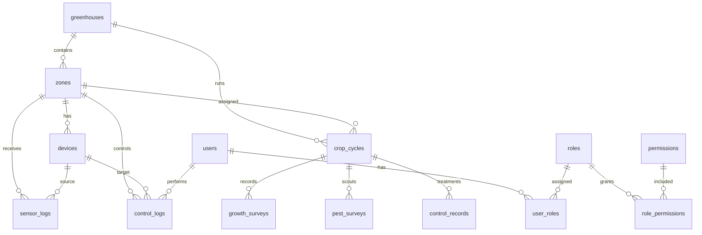

# 3. DB 구상도 — Database Schema

> 기준일: `2026-06-27`
> 기준 버전: `v1.11.10`
> 문서 목적: Green Smart 데이터를 **RBAC / 구역 및 장비 / 작기(Crop Cycle) / 센서 데이터 및 로그** 4대 기둥으로 재정렬한다.

## 1. DB 설계 원칙

> **R4 implementation compatibility:** 현재 물리 DB는 `crop_seasons`, `crop_season_id`, crop record의 `season_id`를 유지한다. `crop_cycle`/`crop_cycle_id`는 제품/API canonical alias이자 future migration target이며, 명시 승인 전까지 실제 rename/migration은 금지한다. 상세 기준은 `docs/rebuild/db-schema-rationalization-plan.md`를 따른다.

- RDB는 MariaDB/MySQL 기준이다.
- 새 작기가 시작될 때 테이블을 새로 만들지 않는다. 목표 모델에서는 `crop_cycles` row로 논리 격리하되, 현재 구현은 `crop_seasons` row로 호환 유지한다.
- 모든 제어/차단/승인/수동 override에는 `user_id` 또는 `actor_type`을 남긴다.
- raw sensor 장기 시계열은 InfluxDB/HA recorder에 위임할 수 있지만, 모델/제어에 필요한 핵심 sensor log는 RDB에 적재 가능해야 한다.
- 모든 실행은 재현 가능해야 한다: 입력 snapshot, safety decision, command, result, actor, timestamp.

---

## 2. 4대 핵심 기둥 ERD



---

## 3. 사용자 및 역할 — RBAC

### 3.1 `users`

```sql
CREATE TABLE users (
  id BIGINT PRIMARY KEY AUTO_INCREMENT,
  ha_user_id VARCHAR(128) UNIQUE NULL,
  username VARCHAR(128) NOT NULL,
  display_name VARCHAR(128) NULL,
  status ENUM('active','disabled') NOT NULL DEFAULT 'active',
  created_at DATETIME NOT NULL DEFAULT CURRENT_TIMESTAMP,
  updated_at DATETIME NOT NULL DEFAULT CURRENT_TIMESTAMP ON UPDATE CURRENT_TIMESTAMP
);
```

### 3.2 `roles`

```sql
CREATE TABLE roles (
  id BIGINT PRIMARY KEY AUTO_INCREMENT,
  code VARCHAR(64) NOT NULL UNIQUE,
  name_ko VARCHAR(128) NOT NULL,
  description TEXT NULL
);
```

Seed:

| code | name_ko | 설명 |
|---|---|---|
| `admin` | 관리자 | 설치, 시스템, DB/API, 장치 매핑, 모든 승인 |
| `farm_owner` | 농장주 | 전략 확인, 주요 승인, 기록 조회/입력 |
| `farm_staff` | 농장직원 | 오늘 할 일, 생육/예찰/방제 기록, 제한된 수동 조작 |

### 3.3 `permissions`

```sql
CREATE TABLE permissions (
  id BIGINT PRIMARY KEY AUTO_INCREMENT,
  code VARCHAR(128) NOT NULL UNIQUE,
  description TEXT NULL
);
```

예시 permission:

```text
crop.read
crop.write
growth_survey.write
pest_scouting.write
control_treatment.write
device.mapping.manage
control.dry_run
control.execute.manual
control.execute.auto_approve
safety.event.ack
safety.event.clear
settings.manage
```

### 3.4 `user_roles`, `role_permissions`

```sql
CREATE TABLE user_roles (
  user_id BIGINT NOT NULL,
  role_id BIGINT NOT NULL,
  greenhouse_id BIGINT NULL,
  created_at DATETIME NOT NULL DEFAULT CURRENT_TIMESTAMP,
  PRIMARY KEY (user_id, role_id, greenhouse_id),
  FOREIGN KEY (user_id) REFERENCES users(id),
  FOREIGN KEY (role_id) REFERENCES roles(id)
);

CREATE TABLE role_permissions (
  role_id BIGINT NOT NULL,
  permission_id BIGINT NOT NULL,
  PRIMARY KEY (role_id, permission_id),
  FOREIGN KEY (role_id) REFERENCES roles(id),
  FOREIGN KEY (permission_id) REFERENCES permissions(id)
);
```

### 3.5 RBAC Permission ↔ Backend Router Middleware 계약

`permissions.code`는 UI 표시용이 아니라 backend write/execute API를 차단하는 실제 권한 계약이다. 모든 `POST`, `PUT`, `PATCH`, `DELETE`, `execute`, `ack`, `clear`, `approve` endpoint는 router 진입 시점에 permission middleware를 통과해야 한다.

#### 3.5.1 Middleware 책임

```text
HA auth token / request user
→ ha_user_id 추출
→ users + user_roles + role_permissions 조회
→ permission array 생성
→ endpoint required_permission과 비교
→ 부족하면 403 + audit log
→ 충분하면 handler 실행
```

Python 의사코드:

```python
async def require_permission(request, permission_code: str):
    ha_user = request.get("hass_user")
    permissions = await load_green_smart_permissions(ha_user.id)
    if permission_code not in permissions:
        await insert_control_log(
            actor_type="user",
            action_type="blocked",
            domain="safety",
            result_status="blocked",
            reason_code="permission_denied",
            result_json={"required_permission": permission_code},
        )
        raise web.HTTPForbidden(text="permission_denied")
    return permissions
```

#### 3.5.2 Endpoint permission matrix

| Router | Method/Path | Required permission | 차단 시 reason_code |
|---|---|---|---|
| `cropRouter` | `GET /api/green_smart/crop/seasons` | `crop.read` | `permission_denied` |
| `cropRouter` | `POST /api/green_smart/crop/seasons` | `crop.write` | `permission_denied` |
| `cropRouter` | `POST /api/green_smart/crop/seasons/{crop_cycle_id}/growth` | `growth_survey.write` | `permission_denied` |
| `cropRouter` | `POST /api/green_smart/crop/seasons/{crop_cycle_id}/pest` | `pest_scouting.write` | `permission_denied` |
| `cropRouter` | `POST /api/green_smart/crop/seasons/{crop_cycle_id}/control` | `control_treatment.write` | `permission_denied` |
| `deviceRouter` | `POST /api/green_smart/zones/device-entity-mappings` | `device.mapping.manage` | `permission_denied` |
| `controlRouter` | `POST /api/green_smart/zones/execute-final-targets` with `dry_run=true` | `control.dry_run` | `permission_denied` |
| `controlRouter` | `POST /api/green_smart/zones/execute-final-targets` with `dry_run=false` | `control.execute.manual` | `permission_denied` |
| `controlRouter` | `POST /api/green_smart/zones/ai-control-outputs/{id}/apply` | `control.execute.manual` or domain-specific approval | `permission_denied` |
| `safetyRouter` | `POST /api/green_smart/zones/safety-guard-events/ack` | `safety.event.ack` | `permission_denied` |
| `safetyRouter` | `POST /api/green_smart/zones/safety-guard-events/clear` | `safety.event.clear` | `permission_denied` |
| `configRouter` | `green_smart/save_config` | `settings.manage` | `permission_denied` |

#### 3.5.3 차단 메커니즘

- Frontend의 버튼 숨김은 UX 보조일 뿐이다.
- Backend는 항상 token-derived permission array를 재검증한다.
- 권한 부족으로 차단된 write/execute 요청은 403을 반환하고 `control_logs` 또는 `audit_logs`에 남긴다.
- `admin`은 모든 permission을 갖지만, SafetyGuard/Interlock 차단을 우회하지 않는다. 권한은 실행 자격이고, 안전 clear는 별도 조건이다.
- `farm_staff`는 기록 입력 중심이며 실제 장치 실행은 기본적으로 `control.dry_run`까지만 허용한다.

---

## 4. 구역 및 장비

### 4.1 `greenhouses`

```sql
CREATE TABLE greenhouses (
  id BIGINT PRIMARY KEY AUTO_INCREMENT,
  name VARCHAR(128) NOT NULL,
  site_code VARCHAR(64) NULL,
  location_name VARCHAR(128) NULL,
  nx INT NULL,
  ny INT NULL,
  active TINYINT(1) NOT NULL DEFAULT 1,
  created_at DATETIME NOT NULL DEFAULT CURRENT_TIMESTAMP
);
```

### 4.2 `zones`

```sql
CREATE TABLE zones (
  id BIGINT PRIMARY KEY AUTO_INCREMENT,
  greenhouse_id BIGINT NOT NULL,
  name VARCHAR(128) NOT NULL,
  zone_type ENUM('greenhouse','nutrient','stevenson','virtual') NOT NULL DEFAULT 'greenhouse',
  sort_order INT NOT NULL DEFAULT 0,
  active TINYINT(1) NOT NULL DEFAULT 1,
  FOREIGN KEY (greenhouse_id) REFERENCES greenhouses(id),
  INDEX idx_zones_greenhouse (greenhouse_id, active)
);
```

### 4.3 `devices`

```sql
CREATE TABLE devices (
  id BIGINT PRIMARY KEY AUTO_INCREMENT,
  greenhouse_id BIGINT NOT NULL,
  zone_id BIGINT NULL,
  device_code VARCHAR(128) NOT NULL,
  device_type ENUM('sensor','roof_window','side_window','screen','fan','heater','irrigation_valve','nutrient_machine','co2','pump','virtual') NOT NULL,
  ha_entity_id VARCHAR(255) NULL,
  mqtt_state_topic VARCHAR(255) NULL,
  mqtt_command_topic VARCHAR(255) NULL,
  capability_json JSON NULL,
  safe_state_json JSON NULL,
  active TINYINT(1) NOT NULL DEFAULT 1,
  created_at DATETIME NOT NULL DEFAULT CURRENT_TIMESTAMP,
  UNIQUE KEY uq_device_code (greenhouse_id, device_code),
  INDEX idx_devices_zone_type (zone_id, device_type),
  FOREIGN KEY (greenhouse_id) REFERENCES greenhouses(id),
  FOREIGN KEY (zone_id) REFERENCES zones(id)
);
```

---

## 5. 작기 — Crop Cycle 및 바인딩 스코프 정책

`crop_cycles` 테이블은 실제 식물이 입식되어 살아 움직이는 재배 구역(`zone_type='greenhouse'`)에만 엄격하게 종속된다. 양액기 구역(`zone_type='nutrient'`)이나 백엽상 구역(`zone_type='stevenson'`)과 같은 공유/인프라 구역 장비는 물리적 작기 ID를 직접 가지지 않고 아래의 **논리적 스코프 추론 규칙**을 따른다.

현재 코드의 `crop_seasons`와 같은 개념이며, 신규 설계명은 `crop_cycles`로 통일한다. 기존 설치와 호환할 때는 view/API에서 alias를 제공한다.

```sql
CREATE TABLE crop_cycles (
  id BIGINT PRIMARY KEY AUTO_INCREMENT,
  greenhouse_id BIGINT NOT NULL,
  zone_id BIGINT NOT NULL, -- 반드시 zone_type='greenhouse'인 물리 재배구역만 바인딩
  crop_type ENUM('tomato','lettuce','paprika','strawberry','cucumber','herb','other') NOT NULL,
  crop_label_ko VARCHAR(64) NOT NULL,
  variety VARCHAR(128) NULL,
  cultivation_type ENUM('hydroponic','soil','substrate','other') NOT NULL DEFAULT 'hydroponic',
  plant_date DATE NOT NULL,
  expected_end_date DATE NULL,
  demolished_at DATE NULL,
  plant_density DECIMAL(10,2) NULL,
  status ENUM('active','harvested','demolished','archived') NOT NULL DEFAULT 'active',
  notes TEXT NULL,
  created_by BIGINT NULL,
  created_at DATETIME NOT NULL DEFAULT CURRENT_TIMESTAMP,
  updated_at DATETIME NOT NULL DEFAULT CURRENT_TIMESTAMP ON UPDATE CURRENT_TIMESTAMP,
  FOREIGN KEY (greenhouse_id) REFERENCES greenhouses(id),
  FOREIGN KEY (zone_id) REFERENCES zones(id),
  FOREIGN KEY (created_by) REFERENCES users(id),
  INDEX idx_crop_cycles_active_zone (greenhouse_id, zone_id, status)
);
```

### 5.1 Zone type별 crop_cycle_id 바인딩 규칙

| `zones.zone_type` | crop_cycle_id 직접 보유 | 로그/제어 바인딩 방식 | 설명 |
|---|---:|---|---|
| `greenhouse` | 예 | 해당 greenhouse zone의 active crop cycle 직접 바인딩 | 실제 식물이 있는 물리 재배 구역 |
| `nutrient` | 아니오 | 같은 `greenhouse_id`의 대표 active crop cycle을 동적 추론 | 양액기/EC/pH/급액 장비는 여러 재배구역에 영향을 줄 수 있음 |
| `stevenson` | 아니오 | 같은 `greenhouse_id`의 대표 active crop cycle 또는 crop_cycle_id NULL | 외기/백엽상 데이터는 작기 직접 종속 아님 |
| `virtual` | 아니오 | rehearsal context가 명시한 crop_cycle_id가 있을 때만 연결 | 가상 장비/테스트 구역 |

### 5.2 대표 active crop cycle 추론 함수

양액기/백엽상/공유 인프라 로그가 crop model feature로 들어갈 때는 아래 순서로 대표 작기를 추론한다.

```text
1. payload나 API request에 crop_cycle_id가 명시되어 있고 같은 greenhouse_id에 속하면 그 값을 사용한다.
2. zone_type='greenhouse'인 zone_id가 명시되어 있으면 해당 zone의 active crop cycle을 사용한다.
3. zone_type='nutrient'이면 같은 greenhouse_id 내 active crop cycle 중 nutrient mapping이 연결된 재배 zone을 우선한다.
4. mapping이 없고 active crop cycle이 1개뿐이면 그 crop_cycle_id를 대표값으로 사용한다.
5. active crop cycle이 2개 이상이면 crop_cycle_id는 NULL로 두고 feature aggregation 단계에서 greenhouse-level shared input으로 처리한다.
6. active crop cycle이 없으면 crop_cycle_id는 NULL이며 모델 입력에는 `source_status='no_active_crop_cycle'`를 표시한다.
```

Python 의사코드:

```python
async def infer_crop_cycle_scope(db, *, greenhouse_id: int, zone_id: int | None, explicit_crop_cycle_id: int | None = None) -> dict:
    if explicit_crop_cycle_id:
        if await crop_cycle_belongs_to_greenhouse(db, explicit_crop_cycle_id, greenhouse_id):
            return {"crop_cycle_id": explicit_crop_cycle_id, "scope": "explicit"}
        return {"crop_cycle_id": None, "scope": "invalid_explicit_crop_cycle"}

    zone = await get_zone(db, zone_id) if zone_id else None
    if zone and zone["zone_type"] == "greenhouse":
        return {"crop_cycle_id": await get_active_crop_cycle_id(db, zone_id), "scope": "direct_greenhouse_zone"}

    active = await list_active_crop_cycles(db, greenhouse_id)
    if zone and zone["zone_type"] == "nutrient":
        mapped = await find_crop_cycle_by_nutrient_mapping(db, greenhouse_id, zone_id)
        if mapped:
            return {"crop_cycle_id": mapped, "scope": "nutrient_mapping"}

    if len(active) == 1:
        return {"crop_cycle_id": active[0]["id"], "scope": "single_active_crop_cycle"}

    return {"crop_cycle_id": None, "scope": "greenhouse_shared_or_ambiguous"}
```

### 5.3 로그 테이블 적용 규칙

| Table | crop_cycle_id 적용 |
|---|---|
| `sensor_logs` | greenhouse zone 센서는 직접 active crop cycle, nutrient/stevenson은 추론 또는 NULL |
| `control_logs` | 작기 영향이 명확하면 추론 crop_cycle_id, 장비 인프라 제어이면 NULL 허용 |
| `growth_surveys` | 반드시 직접 crop_cycle_id 필요. NULL 금지 |
| `pest_surveys` | 반드시 직접 crop_cycle_id 필요. NULL 금지 |
| `control_records` | 반드시 직접 crop_cycle_id 필요. NULL 금지 |

### 5.4 상추 작기 예시

```sql
INSERT INTO crop_cycles
(greenhouse_id, zone_id, crop_type, crop_label_ko, variety, cultivation_type, plant_date, plant_density, status)
VALUES
(1, 1, 'lettuce', '상추', '버터헤드', 'hydroponic', '2026-06-01', 22.0, 'active');
```

## 6. 센서 데이터 및 로그

### 6.1 `sensor_logs`

```sql
CREATE TABLE sensor_logs (
  id BIGINT PRIMARY KEY AUTO_INCREMENT,
  greenhouse_id BIGINT NOT NULL,
  zone_id BIGINT NOT NULL,
  device_id BIGINT NULL,
  sensor_type ENUM('temperature','humidity','co2','light','vpd','ec','ph','vwc','wind_speed','rain','unknown') NOT NULL,
  value DECIMAL(12,4) NOT NULL,
  unit VARCHAR(32) NULL,
  quality ENUM('ok','stale','fixed','out_of_range','missing','estimated') NOT NULL DEFAULT 'ok',
  measured_at DATETIME NOT NULL,
  received_at DATETIME NOT NULL DEFAULT CURRENT_TIMESTAMP,
  raw_payload JSON NULL,
  FOREIGN KEY (greenhouse_id) REFERENCES greenhouses(id),
  FOREIGN KEY (zone_id) REFERENCES zones(id),
  FOREIGN KEY (device_id) REFERENCES devices(id),
  INDEX idx_sensor_logs_zone_type_time (zone_id, sensor_type, measured_at),
  INDEX idx_sensor_logs_quality_time (quality, measured_at),
  INDEX idx_sensor_logs_greenhouse_time (greenhouse_id, measured_at)
);
```

### 6.2 `sensor_logs` 월별 파티셔닝 및 Retention Policy

초 단위 센서 적재는 단일 테이블 index만으로 장기 운영 시 성능이 급격히 저하된다. 운영 DB의 `sensor_logs`는 `measured_at` 기준 **월별 RANGE 파티셔닝**을 기본 전략으로 한다.

#### 6.2.1 파티셔닝 DDL 예시

```sql
CREATE TABLE sensor_logs (
  id BIGINT NOT NULL AUTO_INCREMENT,
  greenhouse_id BIGINT NOT NULL,
  zone_id BIGINT NOT NULL,
  device_id BIGINT NULL,
  sensor_type ENUM('temperature','humidity','co2','light','vpd','ec','ph','vwc','wind_speed','rain','unknown') NOT NULL,
  value DECIMAL(12,4) NOT NULL,
  unit VARCHAR(32) NULL,
  quality ENUM('ok','stale','fixed','out_of_range','missing','estimated') NOT NULL DEFAULT 'ok',
  measured_at DATETIME NOT NULL,
  received_at DATETIME NOT NULL DEFAULT CURRENT_TIMESTAMP,
  raw_payload JSON NULL,
  PRIMARY KEY (id, measured_at),
  INDEX idx_sensor_logs_zone_type_time (zone_id, sensor_type, measured_at),
  INDEX idx_sensor_logs_quality_time (quality, measured_at),
  INDEX idx_sensor_logs_greenhouse_time (greenhouse_id, measured_at)
)
PARTITION BY RANGE COLUMNS (measured_at) (
  PARTITION p202606 VALUES LESS THAN ('2026-07-01'),
  PARTITION p202607 VALUES LESS THAN ('2026-08-01'),
  PARTITION pmax VALUES LESS THAN (MAXVALUE)
);
```

운영 bootstrap/migration은 매월 다음 달 partition을 선제 생성한다.

```sql
ALTER TABLE sensor_logs REORGANIZE PARTITION pmax INTO (
  PARTITION p202608 VALUES LESS THAN ('2026-09-01'),
  PARTITION pmax VALUES LESS THAN (MAXVALUE)
);
```

#### 6.2.2 Retention / Cold Storage 정책

| 데이터 나이 | 저장 위치 | 처리 |
|---|---|---|
| 0~90일 | Hot MariaDB partition | 초/분 단위 조회 및 모델 입력 허용 |
| 91~365일 | Warm MariaDB partition 또는 집계 테이블 | 일/주 단위 리포트와 모델 학습 후보 |
| 1년 초과 | Cold storage | 월별 partition export 후 DB에서 purge |

Cold storage export 예시:

```text
sensor_logs_YYYYMM.parquet 또는 sensor_logs_YYYYMM.csv.gz
metadata: site_id, greenhouse_id, exported_at, row_count, checksum_sha256
```

Purge 규칙:

```text
1. 매월 1일 03:00 local time에 13개월 전 partition을 export한다.
2. export row_count와 checksum을 검증한다.
3. 검증 성공 시 해당 월 partition을 DROP PARTITION 한다.
4. 검증 실패 시 purge 금지, admin alert 생성.
```

실제 장비/운영 분석에 필요한 장기 지표는 raw sensor_logs를 보존하지 않고 별도 daily aggregate table 또는 cold storage에서 재계산한다.

### 6.3 `control_logs`

```sql
CREATE TABLE control_logs (
  id BIGINT PRIMARY KEY AUTO_INCREMENT,
  greenhouse_id BIGINT NOT NULL,
  zone_id BIGINT NOT NULL,
  crop_cycle_id BIGINT NULL,
  device_id BIGINT NULL,
  user_id BIGINT NULL,
  actor_type ENUM('user','system','safety_guard','ml_model','scheduler','edge') NOT NULL,
  action_type ENUM('dry_run','execute','blocked','failsafe','ack','clear','override','approval','mapping_validate') NOT NULL,
  domain ENUM('environment','irrigation','device','crop','safety') NOT NULL,
  command_json JSON NULL,
  safety_decision_json JSON NULL,
  interlock_decision_json JSON NULL,
  result_status ENUM('success','failed','blocked','failsafe','pending','skipped') NOT NULL,
  result_json JSON NULL,
  reason_code VARCHAR(128) NULL,
  created_at DATETIME NOT NULL DEFAULT CURRENT_TIMESTAMP,
  FOREIGN KEY (greenhouse_id) REFERENCES greenhouses(id),
  FOREIGN KEY (zone_id) REFERENCES zones(id),
  FOREIGN KEY (crop_cycle_id) REFERENCES crop_cycles(id),
  FOREIGN KEY (device_id) REFERENCES devices(id),
  FOREIGN KEY (user_id) REFERENCES users(id),
  INDEX idx_control_logs_zone_time (zone_id, created_at),
  INDEX idx_control_logs_user_time (user_id, created_at),
  INDEX idx_control_logs_action_result (action_type, result_status, created_at),
  INDEX idx_control_logs_crop_domain (crop_cycle_id, domain, created_at)
);
```

`user_id`는 수동 조작, 승인, override, ack/clear에서 필수다. 시스템 스케줄러나 SafetyGuard가 수행한 경우에는 `user_id=NULL`, `actor_type='system'|'safety_guard'`로 남긴다.

---

## 7. 작물 기록 테이블

### 7.1 `growth_surveys`

```sql
CREATE TABLE growth_surveys (
  id BIGINT PRIMARY KEY AUTO_INCREMENT,
  crop_cycle_id BIGINT NOT NULL,
  survey_date DATE NOT NULL,
  height_cm DECIMAL(8,2) NULL,
  leaf_count DECIMAL(8,2) NULL,
  stem_diameter_mm DECIMAL(8,2) NULL,
  metrics_json JSON NULL,
  note TEXT NULL,
  created_by BIGINT NULL,
  created_at DATETIME NOT NULL DEFAULT CURRENT_TIMESTAMP,
  FOREIGN KEY (crop_cycle_id) REFERENCES crop_cycles(id),
  FOREIGN KEY (created_by) REFERENCES users(id),
  INDEX idx_growth_cycle_date (crop_cycle_id, survey_date)
);
```

상추 `metrics_json` 예시:

```json
{
  "leafLengthCm": 18.4,
  "leafWidthCm": 12.1,
  "freshWeightG": 145,
  "leafCount": 18,
  "lIndex": 72.5
}
```

### 7.2 병해충/방제

```sql
CREATE TABLE pest_surveys (
  id BIGINT PRIMARY KEY AUTO_INCREMENT,
  crop_cycle_id BIGINT NOT NULL,
  survey_date DATE NOT NULL,
  pest_type VARCHAR(128) NOT NULL,
  severity_code TINYINT NOT NULL,
  location_scope ENUM('all','partial') NOT NULL DEFAULT 'all',
  note TEXT NULL,
  created_by BIGINT NULL,
  created_at DATETIME NOT NULL DEFAULT CURRENT_TIMESTAMP,
  INDEX idx_pest_cycle_date (crop_cycle_id, survey_date),
  FOREIGN KEY (crop_cycle_id) REFERENCES crop_cycles(id),
  FOREIGN KEY (created_by) REFERENCES users(id)
);

CREATE TABLE control_records (
  id BIGINT PRIMARY KEY AUTO_INCREMENT,
  crop_cycle_id BIGINT NOT NULL,
  control_date DATE NOT NULL,
  location_scope ENUM('all','partial') NOT NULL DEFAULT 'all',
  pls_status ENUM('ok','warning','unknown') NOT NULL DEFAULT 'unknown',
  phi_days INT NULL,
  rei_hours INT NULL,
  note TEXT NULL,
  created_by BIGINT NULL,
  created_at DATETIME NOT NULL DEFAULT CURRENT_TIMESTAMP,
  INDEX idx_control_records_cycle_date (crop_cycle_id, control_date),
  FOREIGN KEY (crop_cycle_id) REFERENCES crop_cycles(id),
  FOREIGN KEY (created_by) REFERENCES users(id)
);
```

---

## 8. 조회 인덱스 전략

| 조회 패턴 | 인덱스 |
|---|---|
| 구역별 최신 온도/습도 | `sensor_logs(zone_id, sensor_type, measured_at)` |
| 품질 이상 센서 조회 | `sensor_logs(quality, measured_at)` |
| 작기별 생육조사 | `growth_surveys(crop_cycle_id, survey_date)` |
| 구역별 제어 로그 | `control_logs(zone_id, created_at)` |
| 사용자 수행 이력 | `control_logs(user_id, created_at)` |
| 차단/Fail Safe 이력 | `control_logs(action_type, result_status, created_at)` |
| 작기+도메인 모델 이력 | `control_logs(crop_cycle_id, domain, created_at)` |

---

## 9. 기존 Green Smart 테이블과 매핑

| 신규 설계명 | 현재 구현/호환 테이블 |
|---|---|
| `crop_cycles` | `crop_seasons` |
| `sensor_logs` | `sensor_readings` + HA recorder/InfluxDB |
| `control_logs` | `zone_control_logs`, `device_control_logs`, `irrigation_control_logs`, `audit_logs` |
| `devices` | `devices`, `zone_device_entity_mappings`, `device_status` |
| `users/roles/...` | `green_smart_admin_role_mappings` + HA user id |

신규 구현은 즉시 기존 테이블명을 강제 변경하지 않는다. 먼저 alias/compatibility layer를 두고 vertical slide 단위로 안전하게 migration한다.

---

## VS-003 상추 작기 등록 및 생육조사 입력 DB 계약

VS-003은 설계명 `crop_cycle`/`crop_cycles`를 현재 물리 테이블 `crop_seasons` row와 호환시킨다. 상추 작기 등록 후 생육조사 입력은 아래 저장 계약을 따른다.

| Table | 목적 | VS-003 필드 |
|---|---|---|
| `crop_seasons` | crop_cycle 호환 작기 row | `crop_type='lettuce'`, `zone_id`, `plant_date`, `variety`, `method` |
| `growth_surveys` | 작기별 생육조사 row | `season_id` = `crop_cycle_id`, `crop_type='lettuce'`, `metrics_json` |

상추 `L-Index` 핵심 입력은 `growth_surveys.metrics_json`에 JSON 배열로 저장한다. 필수 metric key는 `leafLength`, `leafWidth`, `leafCount`, `freshWeight`, `plantHeight`이며, `farm_staff`는 `growth_survey.write` 권한 범위에서 입력한다.
