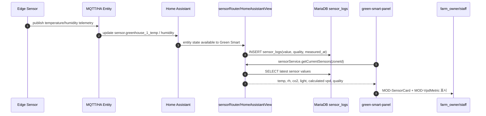
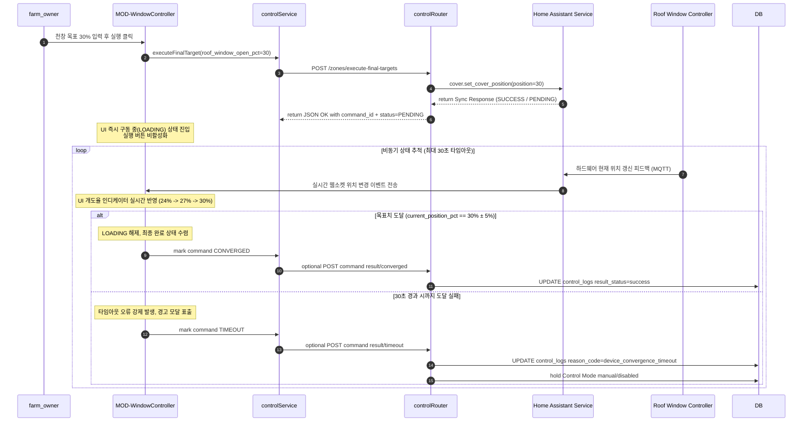
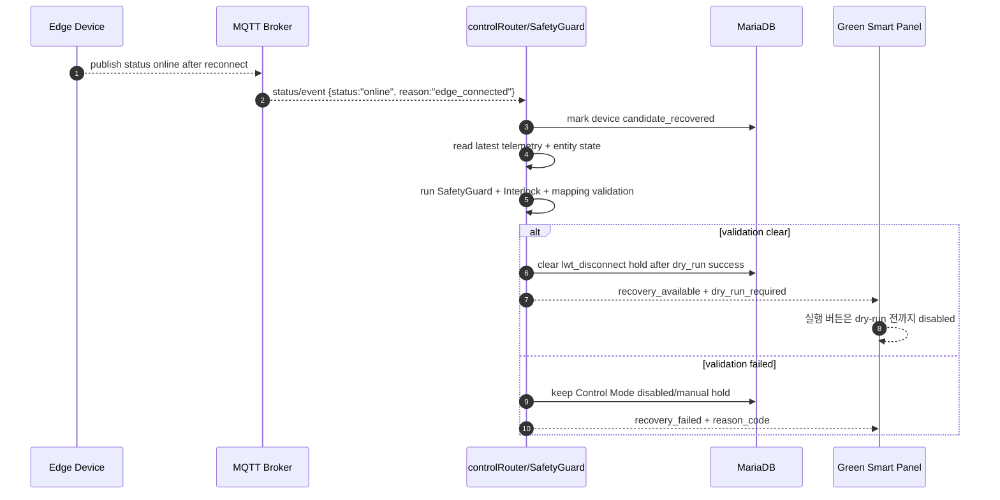
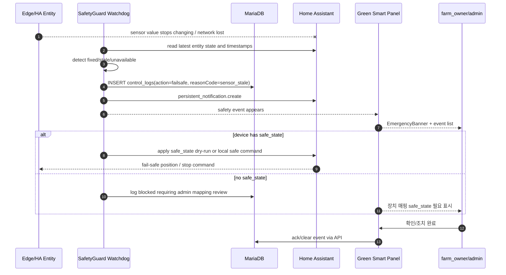
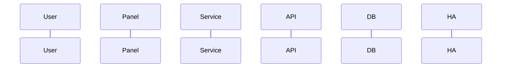
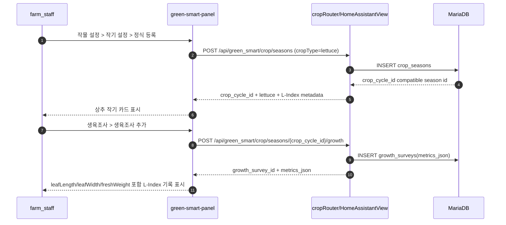

# 4. 통합 시나리오 흐름도 — Workflow Diagram

> 기준일: `2026-06-27`
> 기준 버전: `v1.15.35`
> 문서 목적: UI 컴포넌트, Frontend service, Backend API, DB, MQTT/HA Entity, 하드웨어가 시간 순서대로 어떻게 신호를 주고받는지 정의한다.

## 1. 공통 Actor

| Actor | 설명 |
|---|---|
| `User` | admin/farm_owner/farm_staff |
| `Panel` | `green-smart-panel` Web Component |
| `Service` | Frontend service module |
| `API` | HomeAssistantView backend route |
| `DB` | MariaDB |
| `HA` | Home Assistant entity/service layer |
| `MQTT` | 하드웨어 연결 시 HA MQTT entity 뒤쪽 transport |
| `Edge` | 센서/모터 컨트롤러 |
| `SafetyGuard` | deterministic safety/interlock/fail-safe layer |

---

## 2. 필수 시나리오 A — 실시간 센서 데이터 수집 흐름

### 2.1 목적

온습도 센서가 보내는 데이터를 HA/DB에 적재하고, Dashboard와 환경 제어 페이지에서 온도/습도/VPD를 표시한다.

### 2.2 Mermaid Sequence



### 2.3 단계별 텍스트

1. Edge 센서가 온도/습도/CO2/광량을 측정한다.
2. HA MQTT entity 또는 HA integration entity가 상태를 갱신한다.
3. Green Smart backend는 최신 HA entity 상태를 읽고 필요 시 `sensor_logs`에 적재한다.
4. Backend는 온도/습도로 VPD를 계산한다.
5. Panel은 `sensorService`로 현재 센서값을 조회한다.
6. UI는 온도/습도/VPD 카드와 stale/fixed/out_of_range 상태를 함께 표시한다.
7. 값이 고정되거나 오래되면 SafetyGuard 이벤트 후보가 된다.

### 2.4 수직 슬라이드 VS-001 범위

```text
COM-Metric
→ MOD-SensorCard / MOD-VpdMetric
→ PAGE-Dashboard KPI
→ sensorService.getCurrentSensors
→ sensorRouter current endpoint
→ sensor_logs insert/select
→ VPD calculation
→ stale/fixed quality rule
→ rendered marker test
```

---

## 3. 필수 시나리오 B — 사용자의 수동 하드웨어 제어 흐름: VS-002 천창 개폐 Dry Run 제어

### 3.1 목적

농장주가 천창을 30%로 열고 싶을 때, Green Smart는 즉시 실행하지 않고 Dry Run → SafetyGuard → Interlock → 승인 → HA service call → post-state verification → log 순서로 처리한다.

### 3.2 천창 개폐 수동 제어 및 비동기 피드백 루프 시퀀스



명령 API 성공은 "송신 성공"만 의미한다. 실제 완료 판정은 `command_id`, `entity_id`, `current_position_pct`, `tolerance_pct`, `timeout_ms` 기반의 비동기 수렴으로만 확정한다.

VS-002 Dry Run 응답은 실제 장비를 움직이지 않는 대신 `roof_window_open_pct`, `dry_run=true`, `command_id`, `tolerance_pct`, `timeout_ms`, `actualServiceCallSuppressed=true`를 반환해야 한다. Panel은 `data-vs002-roof-window-dry-run-card`에서 이 값을 보여주고, 실제 실행 버튼을 활성화하지 않는다.

### 3.3 Safety checks

| Check | 예시 reasonCode |
|---|---|
| 강풍 | `wind_speed_above` |
| 강우 | `rain_detected_roof_window_block` |
| 저온 | `temperature_below_window_block` |
| 센서 stale | `sensor_stale` |
| 장치 unavailable | `device_unavailable` |
| mapping invalid | `entity_mapping_invalid` |
| 권한 부족 | `permission_denied` |
| 승인 없음 | `approval_required` |

### 3.3.1 Dry Run 예외 및 복구 규칙

Dry Run은 "실행 전 미리보기"가 아니라 실제 제어 경로의 안전 검증이다. 따라서 Dry Run 단계에서 아래 예외가 발생하면 실제 실행은 절대 활성화하지 않는다.

| 예외 | 감지 기준 | Backend 조치 | UI 조치 | Control Mode |
|---|---|---|---|---|
| 하드웨어 매핑 오류 | entity_id/service/capability 누락 | `blocked`, `reason_code='entity_mapping_invalid'` 로그 | 경고 모달 + 장치 매핑으로 이동 버튼 | `disabled` hold |
| 장치 먹통 | HA entity `unavailable/unknown` 또는 feedback 없음 | `blocked`, `reason_code='device_unavailable'` | 실행 버튼 disabled, 관리자 점검 안내 | `manual` 또는 `disabled` hold |
| 3초 초과 timeout | service dry-run/feedback wait > 3s | `blocked`, `reason_code='device_timeout'` | timeout 경고 모달, 재시도 전 점검 안내 | `manual` hold |
| LWT offline | `reason='lwt_disconnect'` | `failsafe`, `reason_code='lwt_disconnect'` | 현장 Edge 단선 알림 | `disabled` hold |
| SafetyGuard 차단 | 강풍/강우/저온/센서 stale | `blocked` 또는 `failsafe` | 차단 사유와 recovery checklist | unsafe domain disabled |

복구 완료 조건:

```text
1. 장치 매핑 valid
2. HA entity available
3. LWT online 또는 최신 telemetry 확인
4. 최근 1회 dry_run success
5. SafetyGuard/Interlock clear
```

복구 전까지 UI는 `data-control-execute-disabled-reason`에 reason_code를 표시해야 하며 실제 실행 버튼을 활성화하면 안 된다.

#### 3.3.2 LWT 단선 후 자동 복구 Recovery 시퀀스

`lwt_disconnect`로 차단된 장비가 다시 살아났다고 해서 즉시 자동 실행을 재개하면 안 된다. online 이벤트는 복구 시작 신호일 뿐이며, SafetyGuard/Interlock/feedback 검증을 모두 통과해야 한다.



자동 복구 완료 조건:

```text
1. Edge status online 수신
2. 최신 telemetry measured_at이 recovery window 안에 있음
3. HA entity state가 unavailable/unknown이 아님
4. device mapping valid
5. SafetyGuard clear
6. Interlock clear 또는 승인 가능한 상태
7. 최근 1회 dry_run success
```

복구 완료 전까지 `lwt_disconnect`로 인한 `manual`/`disabled` hold는 해제하지 않는다.

### 3.4 로그 필수 필드

```json
{
  "user_id": 12,
  "actor_type": "user",
  "action_type": "execute",
  "domain": "device",
  "command_json": {"device_type":"roof_window","roof_window_open_pct":30},
  "safety_decision_json": {"status":"clear","reasons":[]},
  "result_status": "success"
}
```

---

## 4. 필수 시나리오 C — 시스템 비상 상황 흐름

### 4.1 목적

센서 오작동, 네트워크 단절, 강풍/강우 등 비상 상황 발생 시 AI/사용자 명령보다 로컬 안전 모드가 우선되도록 한다.

### 4.2 Mermaid Sequence



### 4.3 비상 상황별 강제 조치 초안

| 상황 | 판단 | 강제 조치 |
|---|---|---|
| 인터넷 단절 | Center/API sync 실패 | 로컬 HA/Edge safety 유지. Center 명령 무시. 기존 safe policy 사용 |
| HA entity unavailable | 장치/센서 상태 불명 | 자동 실행 차단, safe_state 있으면 Fail Safe |
| 센서 값 고정 | N분 동안 값 변화 없음 | 해당 센서 quality=fixed, 모델 confidence 하락, 위험 제어 차단 |
| 강풍 | 풍속 threshold 초과 | 천창/측창/스크린 위험 동작 차단 또는 safe position |
| 강우 | rain sensor ON | 천창 열림 차단, 닫힘 우선 |
| 저온 | temp lower bound 미만 | 환기/관수 위험 동작 제한, 난방/보온 우선 |
| 펌프 fault | pump fault ON | 관수 제어 실행 차단 |

---

## 5. 수직 슬라이드 시나리오 템플릿

````markdown
## VS-XXX 기능명 Workflow

### 목적

### Actors

### Sequence



### API Contract

### DB Writes

### MQTT/HA Entity Impact

### Safety/Interlock

### Test Cases
````

---

## 6. 구현 전 체크리스트

- [ ] 사용자 액션 시작점이 명확한가?
- [ ] Frontend service가 정해졌는가?
- [ ] Backend route/view가 정해졌는가?
- [ ] DB write/read가 정해졌는가?
- [ ] MQTT 또는 HA entity/service 경로가 정해졌는가?
- [ ] SafetyGuard/Interlock가 실행 직전에 다시 평가되는가?
- [ ] 실패/차단/승인/복구 로그가 남는가?
- [ ] farm_owner/farm_staff/admin별 UI/권한이 분리되는가?

---

## 4. 필수 시나리오 C — VS-003 상추 작기 등록 및 생육조사 입력

### 4.1 목적

`farm_staff`가 Green Smart Panel에서 상추 작기를 등록하고, 같은 `crop_cycle` 기준으로 상추 `L-Index` 생육조사를 입력한다.



### 4.2 수직 슬라이스 범위

```text
data-vs003-lettuce-crop-cycle-card
→ POST /api/green_smart/crop/seasons
→ crop_seasons row as crop_cycle
→ data-vs003-lettuce-growth-survey-card
→ POST /api/green_smart/crop/seasons/{crop_cycle_id}/growth
→ growth_surveys.metrics_json
→ L-Index fields: leafLength, leafWidth, leafCount, freshWeight, plantHeight
```


## RS-023 Virtual execution rehearsal workflow

```text
normal → strong_wind → rain → low_temperature → sensor_fault → blocked → fail_safe → recovery
```

This is a read-only rehearsal. No real-device hookup in RS-023.


## RS-024 Rehearsal result review workflow

```text
virtual rehearsal scaffold → result review projection
```

Each scenario result remains not_run until real virtual runner slice. No real-device hookup in RS-024.


## RS-025 Virtual runner input workflow

```text
result review projection → virtual runner input contract
```

The runner input remains contract_ready_not_executable. No real-device hookup in RS-025.


## RS-026 Virtual runner dry-run result adapter workflow

```text
virtual runner input contract → dry-run result adapter
```

The dry-run result remains simulated_not_executed. No real-device hookup in RS-026.


## RS-027 Virtual rehearsal pass/fail review workflow

```text
dry-run result adapter → pass/fail review projection
```

The pass/fail remains operator_review_only. No real-device hookup in RS-027.


## VS-N003 Real-time monitoring read-only scaffold workflow boundary

```text
VS-N003 Real-time monitoring read-only scaffold
sensor state freshness boundary
No sensor collection/scheduler in VS-N003
```

The workflow defines freshness states before live collection is attached.


## VS-N004 Interlock/Safety core scaffold workflow boundary

```text
VS-N004 Interlock/Safety core scaffold
safety state gate boundary
No approval/override release in VS-N004
```

The workflow defines where safety state gates must sit before future execution/approval work, but does not change live workflows.
